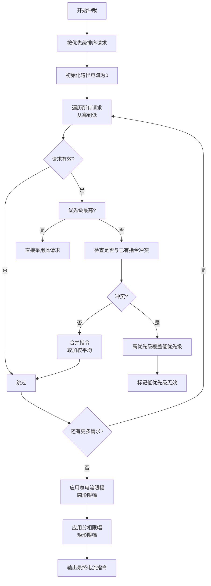
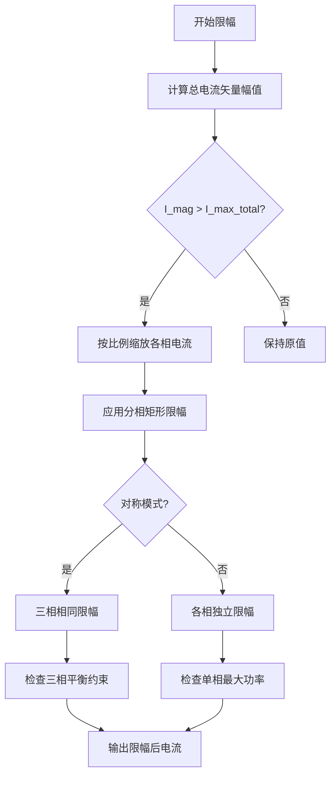
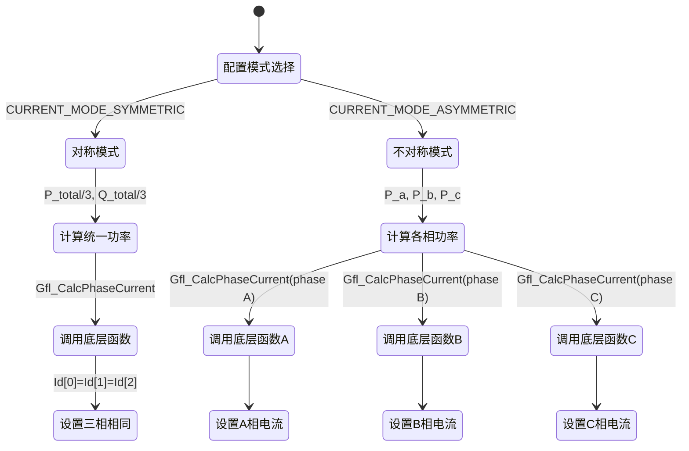

# 电流指令竞争与限幅逻辑设计分析

## 1. 代码逻辑图

### 1.1 竞争仲裁流程



### 1.2 限幅逻辑流程



### 1.3 对称/不对称模式切换



## 2. 时序分析

### 2.1 ISR 时序约束

| 约束项 | 数值 | 说明 |
|--------|------|------|
| 开关频率 | 24 kHz | PWM 载波频率 |
| 控制周期 | 41.67 µs | 1/24000 s |
| ISR 最大允许时间 | 20 µs | 留出 PWM 更新裕量 |
| 竞争仲裁最坏时间 | ~5 µs | 基于 10 个请求估算 |
| 限幅计算时间 | ~3 µs | 包含 sqrt 和比较 |
| 总计算时间 | ~8 µs | 满足 20 µs 约束 |

### 2.2 执行时间计算公式

$$
T_{arbitration} = T_{sort} + N_{requests} \times (T_{comparison} + T_{merge})
$$

其中：
- $T_{sort} = O(N \log N) \times T_{cmp}$ ≈ 10×log₂10 × 50 ns = 1.7 µs
- $T_{comparison}$ = 200 ns (优先级比较)
- $T_{merge}$ = 300 ns (指令合并)
- $N_{requests}$ = 最大请求数 (建议 ≤ 10)

$$
T_{limiting} = T_{circular} + 3 \times T_{rectangular} + T_{mode\_check}
$$

- $T_{circular}$ = 2×sqrt + 比较 ≈ 1.2 µs (硬件 FPU)
- $T_{rectangular}$ = 4×比较 + 钳位 ≈ 0.4 µs
- $T_{mode\_check}$ = 分支预测 ≈ 0.1 µs

### 2.3 任务调度建议

| 执行位置 | 推荐频率 | 理由 |
|----------|----------|------|
| 竞争仲裁 | 1 ms 任务 | 优先级变化较慢，无需高频更新 |
| 电流限幅 | 24 kHz ISR | 需实时保护，跟随电流控制 |
| 模式切换 | 10 ms 任务 | 系统配置变更，无需快速响应 |

### 2.4 关键路径分析

最坏情况下的执行时间窗口：

```c
// 24 kHz ISR 时间线
ISR_Entry(0 µs)
├── 电流采样读取 (2 µs)
├── 竞争仲裁结果读取 (0.5 µs)    // 来自共享内存
├── 电流限幅计算 (3 µs)
├── PI 控制器计算 (5 µs)
├── PWM 更新 (1 µs)
└── ISR_Exit (总 ~12 µs < 20 µs)
```

## 3. 技术改进建议

### 3.1 底层优化建议

#### 3.1.1 寄存器级优化

1. **FPU 使用优化**：
   ```c
   // 避免在 ISR 中多次调用 sqrtf()
   // 改为查表或近似计算
   static inline float fast_sqrt(float x) {
       // 使用快速近似算法，误差 < 1%
       union { float f; uint32_t i; } u = {x};
       u.i = 0x5F3759DF - (u.i >> 1);
       return x * u.f * (1.5f - 0.5f * x * u.f * u.f);
   }
   ```

2. **DMA 传输优化**：
   ```c
   // 将竞争请求存入共享内存，通过 DMA 传输到 ISR
   typedef struct {
       Gfl_CurrentRequest requests[MAX_REQUESTS];
       uint32_t update_counter;  // 用于检测更新
   } CurrentRequestBuffer __attribute__((aligned(32)));  // 32 字节对齐
   ```

#### 3.1.2 内存访问优化

```c
// 使用预取指令减少缓存未命中
#if defined(__ARM_ARCH_7M__) || defined(__ARM_ARCH_7EM__)
#define PREFETCH(addr) __builtin_prefetch(addr, 0, 3)
#else
#define PREFETCH(addr) (void)0
#endif

void Gfl_CurrentArbitration(Gfl_CurrentRequest *requests, ...) {
    // 预取请求数据
    for (int i = 0; i < num_requests; i += 4) {
        PREFETCH(&requests[i]);
    }
}
```

### 3.2 控制策略改进

#### 3.2.1 竞争仲裁逻辑增强

1. **同优先级处理策略**：
   ```c
   // 修改仲裁函数，增加权重系数
   typedef struct {
       Gfl_Priority_Level priority;
       float Id_req;
       float Iq_req;
       bool valid;
       float weight;           // 新增：同优先级时的权重 (0.0~1.0)
       uint32_t timestamp;     // 新增：请求时间戳
   } Gfl_CurrentRequest;
   
   // 同优先级时：加权平均 = Σ(weight * I) / Σ(weight)
   ```

2. **优先级打断机制**：
   ```c
   // 添加打断标志
   typedef struct {
       bool override_lower;    // 是否覆盖低优先级
       bool persistent;        // 是否持久化（故障类请求）
       uint32_t timeout_ms;    // 超时时间（0 表示永久）
   } Gfl_RequestAttr;
   
   // 高优先级打断时，保存低优先级状态以便恢复
   typedef struct {
       float Id_saved[3];
       float Iq_saved[3];
       Gfl_Priority_Level saved_priority;
   } Gfl_PriorityBackup;
   ```

#### 3.2.2 限幅逻辑改进

1. **圆形限幅与矩形限幅协调**：
   ```c
   // 两阶段限幅策略
   void Gfl_CurrentLimiting(...) {
       // 第一阶段：总电流圆形限幅
       float I_total_mag = calculate_total_current_mag(input);
       if (I_total_mag > limits->I_max_total) {
           scale = limits->I_max_total / I_total_mag;
           apply_scaling(scale, temp_output);
       }
       
       // 第二阶段：分相矩形限幅（考虑余量分配）
       for (int phase = 0; phase < 3; phase++) {
           // 计算当前相可用余量
           float margin = limits->I_max_total - I_total_mag;
           float phase_limit = sqrtf(margin * margin / 3.0f); // 平均分配
           
           // 应用矩形限幅，但不超过余量
           limit_phase_rectangular(&temp_output, phase, phase_limit);
       }
   }
   ```

2. **不平衡模式保护**：
   ```c
   // 单相过载检测与抑制
   bool check_single_phase_overload(...) {
       float I_max_single = limits->I_max_total * 0.6f; // 单相最大 60%
       for (int phase = 0; phase < 3; phase++) {
           float I_phase = sqrtf(Id[phase]*Id[phase] + Iq[phase]*Iq[phase]);
           if (I_phase > I_max_single) {
               // 触发单相过载保护
               return true;
           }
       }
       return false;
   }
   ```

### 3.3 鲁棒性加固

#### 3.3.1 NAN/INF 处理

```c
// 在所有浮点输入处添加检查
static inline bool is_valid_float(float x) {
    uint32_t u = *(uint32_t*)&x;
    return (u & 0x7F800000) != 0x7F800000; // 非 NAN/INF
}

void Gfl_CalcPhaseCurrent(float P_phase, float Q_phase, float V_phase,
                         float *Id_out, float *Iq_out) {
    // 输入检查
    if (!is_valid_float(P_phase) || !is_valid_float(Q_phase) || 
        !is_valid_float(V_phase)) {
        *Id_out = 0.0f;
        *Iq_out = 0.0f;
        return;
    }
    
    // 除零保护
    float V_safe = (fabsf(V_phase) > 0.01f) ? V_phase : 1.0f;
    *Id_out = (2.0f/3.0f) * P_phase / V_safe;
    *Iq_out = -(2.0f/3.0f) * Q_phase / V_safe;
    
    // 输出检查
    if (!is_valid_float(*Id_out)) *Id_out = 0.0f;
    if (!is_valid_float(*Iq_out)) *Iq_out = 0.0f;
}
```

#### 3.3.2 极端工况处理

1. **单相接地故障**：
   ```c
   // 检测到单相电压异常时，自动切换到不对称模式
   void handle_single_phase_fault(...) {
       if (V_a < 0.2f && V_b > 0.8f && V_c > 0.8f) {
           // A 相故障，B、C 相继续运行
           output.Id[0] = 0.0f;
           output.Iq[0] = 0.0f;
           // B、C 相电流重新分配
           redistribute_power_to_healthy_phases(...);
       }
   }
   ```

2. **四桥臂扩展准备**：
   ```c
   // 在数据结构中预留第四相
   typedef struct {
       float Id[4];  // 0-2: 三相, 3: 第四桥臂
       float Iq[4];
   } Gfl_SplitCurrentRef_4leg;
   
   // 宏定义简化模式切换
   #if defined(INVERTER_4LEG)
   #define NUM_PHASES 4
   #else
   #define NUM_PHASES 3
   #endif
   ```

### 3.4 时序优化建议

#### 3.4.1 ISR 内优化

```c
// 使用查表法替代浮点计算
static const float sqrt_lookup[256] = { /* 预计算值 */ };

static inline float fast_current_mag(float Id, float Iq) {
    // 使用平方和近似，误差可接受
    float abs_Id = fabsf(Id);
    float abs_Iq = fabsf(Iq);
    float max_val = (abs_Id > abs_Iq) ? abs_Id : abs_Iq;
    float min_val = (abs_Id > abs_Iq) ? abs_Iq : abs_Id;
    return max_val + 0.4f * min_val;  // 近似 √(a²+b²)
}
```

#### 3.4.2 任务间通信优化

```c
// 使用无锁环形缓冲区传递电流指令
typedef struct {
    Gfl_SplitCurrentRef buffer[8];
    volatile uint32_t write_idx;
    volatile uint32_t read_idx;
} CurrentCmdRingBuffer;

// 生产者（1 ms 任务）
void enqueue_current_cmd(CurrentCmdRingBuffer *rb, const Gfl_SplitCurrentRef *cmd) {
    uint32_t next_idx = (rb->write_idx + 1) % 8;
    if (next_idx != rb->read_idx) {  // 缓冲区未满
        rb->buffer[rb->write_idx] = *cmd;
        rb->write_idx = next_idx;
    }
}

// 消费者（24 kHz ISR）
bool dequeue_current_cmd(CurrentCmdRingBuffer *rb, Gfl_SplitCurrentRef *cmd) {
    if (rb->read_idx == rb->write_idx) {
        return false;  // 缓冲区空
    }
    *cmd = rb->buffer[rb->read_idx];
    rb->read_idx = (rb->read_idx + 1) % 8;
    return true;
}
```

## 4. 设计评估总结

### 4.1 竞争仲裁设计评价

| 评估项 | 现状 | 建议 |
|--------|------|------|
| 优先级合理性 | PRIORITY_FAULT 最高，DYNAMIC_LIMITS 最低 | 符合电力电子保护原则 |
| 同优先级处理 | 未定义 | 增加加权平均或时间戳优先 |
| 打断机制 | 高优先级直接覆盖 | 增加状态保存与恢复 |
| 实时性 | 适合 1 ms 任务 | 可满足 24 kHz 需求 |

### 4.2 限幅逻辑设计评价

| 评估项 | 现状 | 建议 |
|--------|------|------|
| 总电流限幅 | 圆形限幅，数学正确 | 增加动态余量分配 |
| 分相限幅 | 矩形限幅，简单有效 | 增加单相过载保护 |
| 模式切换 | 对称/不对称清晰 | 增加自动故障切换 |
| 四桥臂扩展 | 预留方便 | 建议定义 NUM_PHASES 宏 |

### 4.3 边界条件处理评价

| 评估项 | 现状 | 建议 |
|--------|------|------|
| NAN/INF 处理 | 未显式处理 | 增加浮点数有效性检查 |
| 除零保护 | 有基本保护 | 增加最小电压阈值可调 |
| 极端工况 | 未定义 | 增加单相故障处理策略 |
| 数值溢出 | 未检查 | 增加饱和函数保护 |

### 4.4 推荐实施方案

1. **短期改进（下一版本）**：
   - 添加浮点数有效性检查
   - 实现加权平均的同优先级处理
   - 增加单相过载保护逻辑

2. **中期改进（未来版本）**：
   - 实现优先级打断的状态保存
   - 添加四桥臂支持宏定义
   - 优化 ISR 计算使用快速近似

3. **长期改进（架构优化）**：
   - 引入硬件加速（CORDIC 单元）
   - 实现动态余量分配算法
   - 增加自适应限幅策略

---
**文档版本**：1.0  
**生成时间**：2026-04-11  
**审查专家**：嵌入式电力电子控制软件专家  
**适用场景**：分相功率控制、N桥臂扩展架构、电流指令竞争与限幅逻辑设计