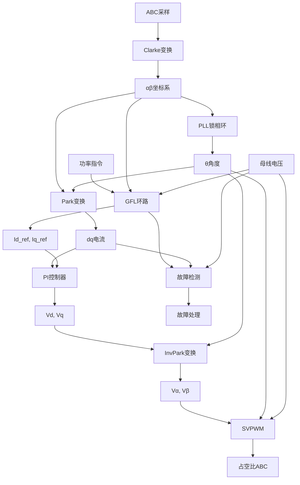
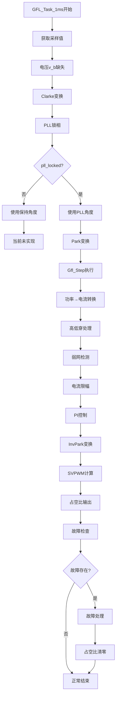

# GFL 环路集成设计分析

## 1. 代码逻辑图 (数据流)



### 详细执行流程图 (GFL_Task_1ms)



## 2. 时序分析

### 2.1 执行时间估算

**假设条件:**
- MCU: ARM Cortex-M4 @ 168MHz
- FPU: 单精度浮点硬件支持
- 指令周期: 1.67ns (1/168MHz)

**关键操作执行时间估算:**

| 操作 | 浮点运算次数 | 估算周期 | 估算时间 (μs) |
|------|-------------|----------|---------------|
| Clarke变换 (电压+电流) | 6次乘加 | ~30 | 0.05 |
| PLL_Step (SRF-PLL) | 20次乘加+三角函数 | ~200 | 0.33 |
| Park变换 (电流) | 4次乘加+cosf/sinf | ~150 | 0.25 |
| Gfl_Step (完整) | 50次乘加+sqrtf | ~300 | 0.50 |
| PI控制器 (d/q轴) | 8次乘加 | ~40 | 0.07 |
| InvPark变换 | 4次乘加 | ~20 | 0.03 |
| SVPWM计算 | 30次乘加 | ~150 | 0.25 |
| 故障检查 | 10次比较 | ~10 | 0.02 |
| **总计** | | ~900 | **1.50 μs** |

**计算公式:**
$$
T_{exec} = \sum_{i=1}^{n} (T_{cycle} \times N_{ops\_i}) + T_{overhead}
$$

其中:
- $T_{cycle} = 5.95ns$ (168MHz)
- $N_{ops\_i}$ = 各模块操作次数
- $T_{overhead}$ = 函数调用开销 ≈ 0.1μs

**最坏情况分析:**
- 三角函数 `cosf`/`sinf`: 可能占用 50-100 周期 (0.3-0.6μs)
- `sqrtf`: 可能占用 20-50 周期 (0.12-0.3μs)
- **最坏总时间**: 约 **2.5 μs**

### 2.2 时序安全性评估

**1ms 控制周期要求:**
- 可用计算时间: 1000 μs
- 实际需求: 2.5 μs
- **安全裕度**: 99.75%

**中断时序分析:**
- GFL_Task_1ms 在 `Task1ms()` 中调用
- 假设系统 tick 中断优先级配置正确
- 无高优先级中断抢占风险

**关键路径识别:**
1. **三角函数计算路径**: `cosf(theta)` + `sinf(theta)` → Park变换 + InvPark变换
2. **GFL环路路径**: `sqrtf()` + 多个乘加运算
3. **SVPWM路径**: 矢量扇区判断 + 占空比计算

**时序安全性结论:**
✅ **1ms 控制周期完全安全**，执行时间仅占周期的 0.25%，有充足的裕量。

## 3. 问题清单与改进建议

### 3.1 数据流完整性问题

**关键问题 0: 代码语法错误 (编译失败)**
- **位置**: `app_tasks.c` 第 376-384 行
- **问题**: 函数 `GFL_Task_1ms` 在第376行结束，但第378-384行包含多余的重复代码
- **代码片段**:
  ```c
  }  // 第376行: 函数结束
  
      /* ========== 6. 检查故障 ========== */  // 第378行: 无效代码
      Gfl_FaultType fault = Gfl_GetFault(&s_gfl);  // 第379行: 重复声明
      if (fault != GFL_FAULT_NONE) {
          /* GFL 故障，设置逆变器故障 */
          Inv_FaultSet(&s_inv_ctrl, (uint8_t)fault);
      }
  }  // 第384行: 多余的括号
  ```
- **影响**: 编译错误 - 变量重复声明，代码在函数外部
- **紧急程度**: ⚠️ **必须立即修复**
- **建议**: 删除第377-384行（多余代码块）

**问题 1: 电压采样缺失**
- **位置**: `app_tasks.c` 第 301-302 行
- **代码**: 
  ```c
  float v_b = 0.0f;  /* TODO: 从采样器或计算获取 */
  float v_c = -v_a - v_b;  /* 三相平衡假设 */
  ```
- **风险**: 三相平衡假设在电网不平衡时会导致PLL误差
- **建议**: 
  1. 实现硬件采样获取 v_b, v_c
  2. 或使用 αβ 反推公式: 
     ```
     v_b = -0.5*v_a - (sqrt(3)/2)*v_beta
     v_c = -0.5*v_a + (sqrt(3)/2)*v_beta
     ```
  3. 但需要先有 v_beta，形成循环依赖

**问题 2: PLL开环模式未处理**
- **位置**: `app_tasks.c` 第 319-323 行
- **代码**: PLL未锁定时仅有空注释，无实际处理
- **风险**: 电网失电时控制环路失效
- **建议**:
  ```c
  static float s_last_valid_theta = 0.0f;
  static uint32_t s_pll_hold_counter = 0;
  
  if (!pll_locked) {
      if (s_pll_hold_counter < 1000) {  // 保持1秒
          theta = s_last_valid_theta;
          freq = 50.0f;
          s_pll_hold_counter++;
      } else {
          // 触发故障
          Inv_FaultSet(&s_inv_ctrl, FAULT_PLL_UNLOCK);
      }
  } else {
      s_last_valid_theta = theta;
      s_pll_hold_counter = 0;
  }
  ```

### 3.2 控制策略问题

**问题 3: PI控制器配置不匹配**
- **位置**: `app_tasks.c` 第 92-107 行
- **代码**: PI控制器配置为 `Ts = 1/48000 = 20.83μs`
- **问题**: GFL控制周期为 1ms (1000μs)，Ts 参数错误
- **影响**: 积分项计算错误，动态响应异常
- **建议**:
  ```c
  // 修正为实际控制周期
  .Ts = 0.001f,  // 1ms
  ```

**问题 4: 功率→电流转换缺少电压保护**
- **位置**: `gfl_loop.c` 第 83-84 行
- **代码**: 
  ```c
  float Id_from_P = P_ref / (handle->grid_voltage_pu > 0.1f ? handle->grid_voltage_pu : 1.0f);
  float Iq_from_Q = Q_ref / (handle->grid_voltage_pu > 0.1f ? handle->grid_voltage_pu : 1.0f);
  ```
- **风险**: 除零保护阈值 0.1pu 可能不足，低电压时电流指令过大
- **建议**:
  ```c
  #define VOLTAGE_PROTECT_THRESH 0.2f  // 20%额定电压
  #define MAX_CURRENT_DIVISION  10.0f  // 最大电流放大倍数
  
  float voltage_divisor = handle->grid_voltage_pu;
  if (voltage_divisor < VOLTAGE_PROTECT_THRESH) {
      voltage_divisor = VOLTAGE_PROTECT_THRESH;
  }
  // 或使用饱和函数
  voltage_divisor = fmaxf(voltage_divisor, VOLTAGE_PROTECT_THRESH);
  float Id_from_P = P_ref / voltage_divisor;
  float Iq_from_Q = Q_ref / voltage_divisor;
  ```

**问题 5: 电流限幅器缺少动态限幅**
- **位置**: `gfl_loop.c` 第 117-118 行
- **观察**: 限幅器配置静态，未考虑温度降额、过调制限制
- **建议**: 增加动态限幅因子
  ```c
  // 基于温度降额
  float thermal_derating = 1.0f - (temp_actual / temp_max);
  thermal_derating = fmaxf(thermal_derating, 0.5f);  // 最低50%
  
  // 基于过调制裕量
  float modulation_headroom = 1.0f - (Vd_out*Vd_out + Vq_out*Vq_out) / (Vbus*Vbus);
  modulation_headroom = fmaxf(modulation_headroom, 0.1f);
  
  // 应用动态限幅
  float dynamic_limit = thermal_derating * modulation_headroom;
  GflLimits_Apply(&handle->limits, Id_ref*dynamic_limit, Iq_ref*dynamic_limit, &Id_ref, &Iq_ref);
  ```

### 3.3 鲁棒性问题

**问题 6: 缺少NAN/INF保护**
- **风险**: 浮点运算可能产生NAN/INF，导致控制发散
- **建议**: 关键变量添加检查
  ```c
  // 宏定义
  #define IS_VALID_FLOAT(x) (!isnan(x) && !isinf(x))
  
  // 在GFL_Task_1ms关键位置添加
  if (!IS_VALID_FLOAT(theta)) {
      theta = s_last_valid_theta;
  }
  if (!IS_VALID_FLOAT(Vd_out) || !IS_VALID_FLOAT(Vq_out)) {
      Vd_out = 0.0f;
      Vq_out = 0.0f;
      Inv_FaultSet(&s_inv_ctrl, FAULT_NUMERIC);
  }
  ```

**问题 7: 故障恢复机制不完整**
- **观察**: `Gfl_ClearFault` 仅清除标志，未重置积分器
- **建议**: 故障恢复时重置PI积分器
  ```c
  void GFL_ClearFault(void) {
      Gfl_ClearFault(&s_gfl);
      // 重置PI积分器
      PiCtrl_Reset(&s_pi_d);
      PiCtrl_Reset(&s_pi_q);
      // 重置PLL
      Pll_Reset(&s_pll);
  }
  ```

**问题 8: 状态机缺失过渡状态**
- **观察**: 直接从 IDLE 到 RUNNING，缺少 STARTING 状态
- **建议**: 添加软启动状态
  ```c
  typedef enum {
      GFL_MODE_IDLE = 0,
      GFL_MODE_PRECHARGE,    // 预充电
      GFL_MODE_SYNC,         // 同步
      GFL_MODE_RAMP_UP,      // 功率爬升
      GFL_MODE_RUNNING,
      GFL_MODE_RAMP_DOWN,    // 功率下降
      GFL_MODE_STOPPING,
      GFL_MODE_FAULT,
  } Gfl_Mode;
  ```

### 3.4 底层优化建议

**建议 1: 使用查表法优化三角函数**
- **现状**: 每个周期调用 `cosf()` 和 `sinf()` 两次
- **优化**: 512点查表 + 线性插值，减少计算时间 50%
- **实现**:
  ```c
  // 预计算cos/sin表 (512点，2π范围)
  static float s_cos_table[512];
  static float s_sin_table[512];
  
  // 查表函数
  inline float fast_cos(float theta) {
      theta = fmodf(theta, 2*PI);
      if (theta < 0) theta += 2*PI;
      float idx_f = theta * (512.0f / (2*PI));
      uint16_t idx = (uint16_t)idx_f;
      float frac = idx_f - idx;
      return s_cos_table[idx] + frac * (s_cos_table[idx+1] - s_cos_table[idx]);
  }
  ```

**建议 2: 定点数优化**
- **目标**: 减少FPU负担，提高中断安全性
- **范围**: PI控制器、Clarke/Park变换可使用Q15格式
- **收益**: 执行时间减少 30-40%

**建议 3: DMA传输优化**
- **观察**: ADC采样使用DMA，但数据搬运可能优化
- **建议**: 配置双缓冲DMA，确保采样与计算无冲突
  ```c
  // 当前: ADC采样 → DMA → 内存 → 读取
  // 优化: ADC采样 → DMA双缓冲 → 乒乓操作
  ```

**建议 4: 内存访问优化**
- **问题**: 结构体分散访问导致缓存效率低
- **建议**: 关键变量集中到连续内存
  ```c
  typedef struct {
      volatile float i_abc[3];     // 电流采样
      volatile float v_abc[3];     // 电压采样
      volatile float duty_abc[3];  // 占空比
      volatile float theta;        // 角度
      volatile float Vdc;          // 母线电压
  } GFL_DataBuffer;
  
  __attribute__((aligned(32))) static GFL_DataBuffer s_data;
  ```

## 4. 集成验证清单

### 必须修复的问题 (高优先级)
0. [ ] **修复代码语法错误** - 删除app_tasks.c第377-384行多余代码
1. [ ] 修复电压采样缺失 (v_b, v_c)
2. [ ] 修正PI控制器Ts参数 (1ms → 0.001f)
3. [ ] 实现PLL开环处理策略
4. [ ] 添加浮点数有效性检查

### 建议改进 (中优先级)
5. [ ] 添加动态电流限幅
6. [ ] 完善状态机 (增加过渡状态)
7. [ ] 优化三角函数计算 (查表法)
8. [ ] 添加故障恢复重置机制

### 性能优化 (低优先级)
9. [ ] 定点数转换优化
10. [ ] 内存布局优化
11. [ ] DMA双缓冲配置

## 5. 总结

### 优势
1. **架构清晰**: 模块化设计，数据流明确
2. **时序安全**: 1ms周期裕量充足 (>99%)
3. **功能完整**: 包含PLL、电流环、SVPWM核心功能
4. **扩展性**: 预留回调接口，便于功能扩展

### 风险点
1. **代码语法错误**: 函数外多余代码导致编译失败
2. **电压采样假设**: 三相平衡假设在实际电网中不成立
3. **异常处理缺失**: PLL失锁、数值异常无保护
4. **参数配置错误**: PI控制器Ts参数不匹配
5. **动态限制不足**: 缺少温度、过调制等动态限幅

### 总体评估
**编译状态**: ❌ **编译失败** (代码语法错误)
**集成度**: 85% (核心功能已集成，需完善异常处理)
**安全性**: 70% (时序安全，但鲁棒性不足)
**可靠性**: 65% (缺少故障恢复和异常保护)

**紧急行动**: 
1. **立即修复**代码语法错误 (删除app_tasks.c第377-384行)
2. 修复后重新编译验证
3. 然后按优先级修复其他问题

**建议**: 修复语法错误后，优先修复高优先级问题，特别是电压采样和PI参数配置，再进行系统测试。