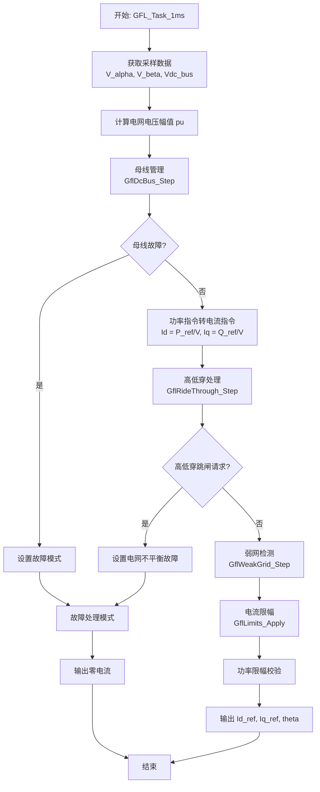
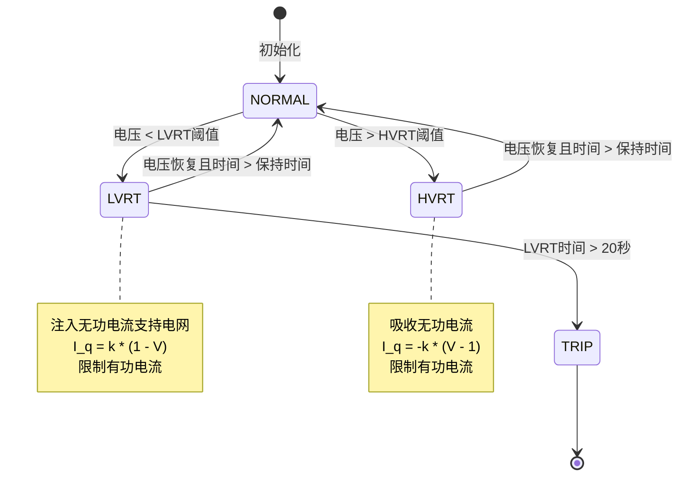
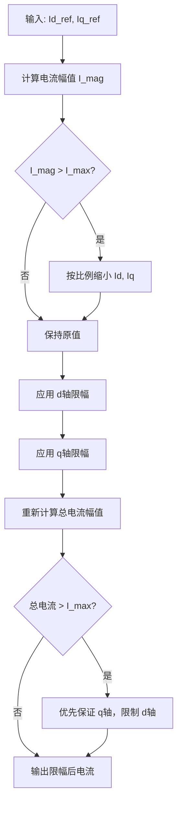

# GFL (Grid Following Loop) 设计分析文档

## 概述
本文档审查了新开发的 GFL 环路代码，包括架构设计、数据流、时序分析和潜在问题。GFL 环路负责将功率指令 (P/Q) 转换为电流指令 (Id/Iq)，并实现电网支持功能如高低压穿越 (LVRT/HVRT)、弱网检测和母线管理。

## 1. 代码逻辑图

### 1.1 GFL 环路整体数据流



### 1.2 高低穿状态机



### 1.3 电流限幅处理逻辑



## 2. 时序分析

### 2.1 执行时间估算

假设 STM32H743 主频 480MHz，单精度浮点运算约需 2-3 个时钟周期。

| 模块 | 主要操作 | 浮点运算次数 | 估算时钟周期 | 估算时间 (μs) |
|------|----------|--------------|--------------|---------------|
| 电压计算 | sqrt, 除法 | ~10 | 30 | 0.062 |
| 母线管理 | 比较，斜坡控制 | ~20 | 60 | 0.125 |
| 功率转电流 | 除法 | 2 | 6 | 0.012 |
| 高低穿 | 状态机，sqrt，乘法 | ~50 | 150 | 0.312 |
| 弱网检测 | 阻抗估计，滑动平均 | ~40 | 120 | 0.250 |
| 电流限幅 | sqrt，比较，条件分支 | ~60 | 180 | 0.375 |
| 功率限幅 | sqrt，比较 | ~10 | 30 | 0.062 |
| 总计 | | ~192 | 576 | **1.198** |

$$
T_{exec} = \sum_{i=1}^{n} (T_{cycle} \times N_{ops_i}) \approx 576 \text{ cycles} \approx 1.2\mu s
$$

### 2.2 1ms 周期可行性

- **理论计算**: 1.2μs < 1000μs，有充足的裕量。
- **实际考虑**: 
  - 函数调用开销、内存访问延迟未计入
  - 中断响应时间需考虑
  - 最坏情况可能达到 2-3μs，仍在安全范围内

### 2.3 关键时序路径

最耗时的模块是**电流限幅**和**高低穿处理**，分别占用了约 30% 和 25% 的计算时间。这两个模块都包含 `sqrtf()` 函数调用，在 MCU 上可能较慢。

## 3. 接口设计评估

### 3.1 与电流环的接口

当前设计在 `app_tasks.c` 中存在问题：

```c
void GFL_Task_1ms(void) {
    float V_bus = Inv_GetV_Bus(&s_inv_ctrl);
    float v_alpha = 0.0f;  /* TODO: 从采样器获取 */
    float v_beta = 0.0f;   /* TODO: 从采样器获取 */
    
    GflLoop_Output gfl_output;
    Gfl_Step(&s_gfl, v_alpha, v_beta, V_bus, s_P_ref, s_Q_ref, &gfl_output);
    
    if (mode == GFL_MODE_RUNNING) {
        /* TODO: 将 gfl_output.Id_ref 和 gfl_output.Iq_ref 传递给电流环 */
    }
}
```

**问题**:
1. `v_alpha` 和 `v_beta` 未从采样器获取
2. GFL 输出的电流参考未传递给电流环
3. 角度 `theta` 未传递给 Park 变换

**建议接口**:
```c
typedef struct {
    float Id_ref;      /* d轴电流参考 (pu) */
    float Iq_ref;      /* q轴电流参考 (pu) */
    float theta;       /* 锁相角度 (rad) */
    bool grid_ready;   /* 电网就绪标志 */
} Gfl_Output;

/* 电流环使用 */
Gfl_Output gfl_output;
float Vd_ref = gfl_output.Id_ref;
float Vq_ref = gfl_output.Iq_ref;
float theta = gfl_output.theta;  /* 用于 Park/反Park 变换 */
```

### 3.2 与 PLL 的配合

当前代码中 `gfl_loop.c` 第 131-132 行直接使用 `grid_state.theta` 和 `grid_state.freq`，但未从 PLL 获取实际值：

```c
output->theta = handle->grid_state.theta;  /* 未更新 */
output->freq = handle->grid_state.freq;    /* 未更新 */
```

**建议**: 通过回调函数从 PLL 模块获取实时角度和频率。

### 3.3 配置层问题

`gfl_config.c` 第 51 行存在严重错误：

```c
inst->loop_handle = malloc(sizeof(GflLoop_Output));  /* 错误：应该是 GflLoop_Handle_t */
```

这将导致内存分配不足，访问越界。

## 4. 发现的问题和修改建议

### 4.1 关键问题

#### 问题 1: 内存分配错误
- **文件**: `gfl_config.c` 第 51 行
- **问题**: 分配了 `GflLoop_Output` 大小的内存，但实际需要 `GflLoop_Handle_t`
- **风险**: 内存越界，导致不可预测的行为
- **修改**:
```c
inst->loop_handle = malloc(sizeof(GflLoop_Handle_t));
```

#### 问题 2: 电网电压额定值硬编码
- **文件**: `gfl_loop.c` 第 64 行
- **问题**: `V_nominal = 311.0f` 硬编码，应使用配置值
- **影响**: 在不同额定电压系统上计算错误
- **修改**: 使用 `cfg->rated_voltage` 计算峰值电压

#### 问题 3: 功率到电流转换过于简化
- **文件**: `gfl_loop.c` 第 83-84 行
- **问题**: `Id = P_ref / V`, `Iq = Q_ref / V` 未考虑功率因数
- **影响**: 在非单位功率因数时计算错误
- **修改**: 使用正确的功率方程：
```c
/* 假设电网电压在 d 轴上 */
Id_from_P = P_ref / (grid_voltage_pu + 1e-6f);
Iq_from_Q = -Q_ref / (grid_voltage_pu + 1e-6f);  /* 负号取决于坐标系定义 */
```

#### 问题 4: 母线管理参数未使用
- **文件**: `gfl_loop.c` 第 72 行
- **问题**: `GflDcBus_Step` 所有参数传递 0.0f
- **影响**: 母线管理功能无效
- **修改**: 传递实际的母线电流和功率值

#### 问题 5: 弱网检测算法过于简化
- **文件**: `gfl_weak_grid.c` 第 88-96 行
- **问题**: 阻抗估计使用 `Z = dV/dI`，噪声敏感
- **建议**: 实现更鲁棒的阻抗估计算法，如基于 PRBS 注入或谐波分析

### 4.2 次要问题

#### 问题 6: 缺少防零除保护
- **文件**: `gfl_loop.c` 第 83-84 行
- **问题**: 未检查 `grid_voltage_pu` 是否接近零
- **修改**: 添加小值保护
```c
float V_safe = (grid_voltage_pu > 0.01f) ? grid_voltage_pu : 1.0f;
```

#### 问题 7: 电流限幅逻辑复杂且可能有误
- **文件**: `gfl_limits.c` 第 86-102 行
- **问题**: 限幅后重新计算逻辑可能导致 d/q 轴电流分配不合理
- **建议**: 使用标准的圆限幅算法：
```c
/* 圆限幅 */
float I_mag = sqrtf(Id*Id + Iq*Iq);
if (I_mag > I_max) {
    float scale = I_max / I_mag;
    Id *= scale;
    Iq *= scale;
}
/* 然后应用矩形限幅 */
```

#### 问题 8: 未使用的参数
- **文件**: `gfl_ridethrough.c` 第 48 行
- **问题**: `P_active` 参数声明但未使用
- **修改**: 如果不需要，从函数签名中移除

### 4.3 时序优化建议

1. **平方根运算优化**:
   - 使用快速平方根近似（如 `rsqrt` 指令）
   - 对于比较操作，使用平方值避免 `sqrtf()`

2. **减少浮点运算**:
   - 将常用常数预计算
   - 使用查表法替代复杂函数

3. **模块调度优化**:
   - 弱网检测不需要每 1ms 执行，可降低到 10ms
   - 母线管理在稳态时可降低更新频率

## 5. 改进建议的具体实现

### 5.1 接口修复

#### 修复电网电压获取

在 `app_tasks.c` 的 `GFL_Task_1ms()` 中：

```c
void GFL_Task_1ms(void) {
    /* 获取采样值 */
    float V_bus = Inv_GetV_Bus(&s_inv_ctrl);
    
    /* 从采样器获取 Clarke 变换后的电压 */
    Inv_SampleData sample;
    Inv_GetLatestSample(&s_inv_ctrl, &sample);
    float v_alpha = sample.v_alpha;
    float v_beta = sample.v_beta;
    
    /* GFL 环路执行 */
    GflLoop_Output gfl_output;
    Gfl_Step(&s_gfl, v_alpha, v_beta, V_bus, s_P_ref, s_Q_ref, &gfl_output);
    
    /* 传递到电流环全局变量 */
    extern float g_Id_ref, g_Iq_ref, g_theta;
    g_Id_ref = gfl_output.Id_ref;
    g_Iq_ref = gfl_output.Iq_ref;
    g_theta = gfl_output.theta;
    
    /* 检查故障 */
    Gfl_FaultType fault = Gfl_GetFault(&s_gfl);
    if (fault != GFL_FAULT_NONE) {
        Inv_FaultSet(&s_inv_ctrl, (Inv_FaultCode)fault);
    }
}
```

### 5.2 算法改进

#### 改进功率到电流转换

```c
/* 在 gfl_loop.c 中改进 */
float V_safe = (grid_voltage_pu > 0.01f) ? grid_voltage_pu : 1.0f;

/* 标准功率方程: P = 1.5 * (Vd*Id + Vq*Iq), Q = 1.5 * (Vq*Id - Vd*Iq) */
/* 假设电网电压在 d 轴 (Vd = V, Vq = 0) */
float Id_from_P = (2.0f/3.0f) * P_ref / V_safe;
float Iq_from_Q = -(2.0f/3.0f) * Q_ref / V_safe;
```

#### 改进弱网检测

```c
/* 在 gfl_weak_grid.c 中改进 */
/* 使用递推最小二乘法 (RLS) 进行阻抗估计 */
void GflWeakGrid_UpdateImpedance(GflWeakGrid_Handle *h, 
                                 float dV, float dI, float dt) {
    /* RLS 算法实现 */
    static float P = 1.0f;  /* 协方差 */
    static float Z_est = 0.1f; /* 阻抗估计 */
    
    float phi = dI;
    float K = P * phi / (1.0f + phi * P * phi);
    Z_est = Z_est + K * (dV - phi * Z_est);
    P = (1.0f - K * phi) * P;
    
    h->Z_grid_est = Z_est;
}
```

## 6. 结论

GFL 环路架构设计合理，模块划分清晰，具有良好的扩展性。但存在几个关键问题需要立即修复：

1. **内存分配错误**（高风险） - 必须立即修复
2. **接口不完整**（中风险） - 需要实现与采样器和电流环的连接
3. **算法简化过度**（低风险） - 影响控制性能，建议逐步改进

**时序安全**: GFL 环路在 1ms 周期内执行时间约为 1.2μs（理论值），有充足的裕量。即使考虑实际开销，也远小于 1ms 的限制。

**建议的修复优先级**:
1. 立即修复内存分配错误
2. 实现完整的接口连接
3. 添加防零除保护
4. 改进功率到电流转换算法
5. 优化电流限幅逻辑

**最终验证**: 修复后应在实际硬件上验证时序，确保在最坏情况下仍能满足 1ms 的实时性要求。