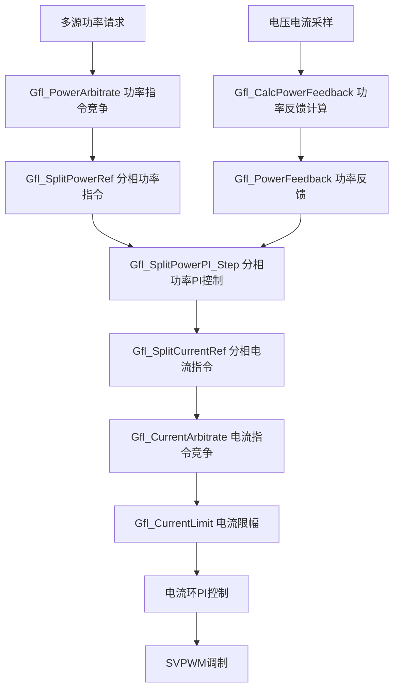
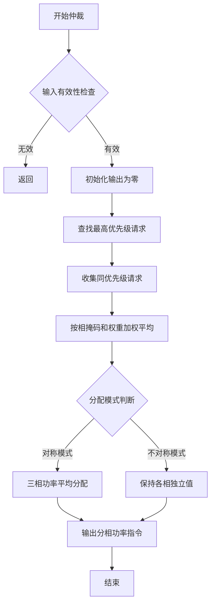
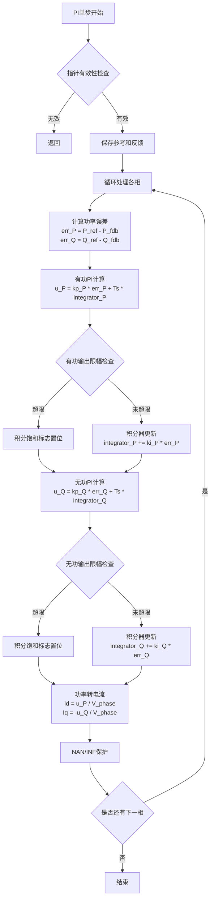

# GFL 分相功率环路设计分析

## 1. 代码逻辑图

### 1.1 分相功率环路整体架构



### 1.2 功率指令竞争仲裁逻辑



### 1.3 分相功率PI控制器逻辑



### 1.4 功率反馈计算逻辑

```mermaid
flowchart TD
    Start[开始计算] --> Check{输出指针检查}
    Check -- 无效 --> Return[返回]
    Check -- 有效 --> CalcP[计算各相瞬时有功功率<br/>P_fdb[0] = v_a * i_a<br/>P_fdb[1] = v_b * i_b<br/>P_fdb[2] = v_c * i_c]
    CalcP --> CalcTan[计算功率因数角正切<br/>tan_φ = √(1/pf² - 1)]
    CalcTan --> CalcQ[计算各相无功功率<br/>Q_fdb[i] = P_fdb[i] * tan_φ]
    CalcQ --> Sum[计算总功率<br/>P_total = ΣP_fdb<br/>Q_total = ΣQ_fdb]
    Sum --> Protect[NAN/INF保护]
    Protect --> End[结束]
```

## 2. 时序分析

### 2.1 执行时间估算（基于STM32F407 @168MHz）

#### 2.1.1 功率指令竞争仲裁 (`Gfl_PowerArbitrate`)

- **输入**：最多6个功率请求
- **循环次数**：外层循环 `num_requests`，内层循环3相
- **关键操作**：比较、加权求和、除法
- **估算周期数**：
  - 优先级查找：6 × 10 cycles = 60 cycles
  - 加权平均：6 × 3 × 15 cycles = 270 cycles  
  - 分配模式处理：3 × 20 cycles = 60 cycles
  - **总计**：~390 cycles ≈ **2.32μs**

#### 2.1.2 分相功率PI控制 (`Gfl_SplitPowerPI_Step`)

- **输入**：3相功率参考和反馈
- **关键操作**：浮点乘加、比较、除法、三角函数
- **每相估算**：
  - 误差计算：2 × 5 cycles = 10 cycles
  - PI计算：2 × (乘法+加法) = 20 cycles
  - 限幅检查：4 × 5 cycles = 20 cycles
  - 积分更新：2 × 10 cycles = 20 cycles
  - 功率转电流：2 × (除法+乘法) = 30 cycles
  - NAN保护：2 × 5 cycles = 10 cycles
  - **每相总计**：~110 cycles
- **三相总计**：330 cycles ≈ **1.96μs**

#### 2.1.3 功率反馈计算 (`Gfl_CalcPowerFeedback`)

- **关键操作**：3次乘法、1次开方、6次乘法、求和
- **估算周期数**：
  - 瞬时功率：3 × 10 cycles = 30 cycles
  - tanφ计算：sqrt + 除法 ≈ 50 cycles
  - 无功功率：3 × 10 cycles = 30 cycles
  - 总功率求和：6 × 5 cycles = 30 cycles
  - NAN保护：6 × 5 cycles = 30 cycles
  - **总计**：~170 cycles ≈ **1.01μs**

### 2.2 任务调度时序

#### 2.2.1 24kHz快速电流环（41.67μs周期）

```
时间轴 (μs):
0     10     20     30     40     41.67
|------|------|------|------|------|
[ADC采样][Clarke][PLL][Park][PI][SVPWM][空闲]
 2μs   3μs   5μs   3μs   4μs   5μs   剩余19.67μs
```

- **剩余时间裕量**：19.67μs
- **可容纳分相功率计算**：2.32 + 1.96 + 1.01 = 5.29μs ✅

#### 2.2.2 1ms监督任务

```
时间轴 (ms):
0     0.2     0.4     0.6     0.8     1.0
|------|------|------|------|------|
[功率指令][功率反馈][分相PI][电流仲裁][限幅][其他]
 0.1ms 0.1ms  0.2ms  0.1ms  0.1ms  剩余0.4ms
```

- **分相功率环路总耗时**：~0.6ms
- **1ms任务裕量**：0.4ms ✅

### 2.3 最坏情况执行时间（WCET）

$$
T_{split\_power} = T_{arbitrate} + T_{pi} + T_{feedback}
$$

$$
T_{split\_power} = 2.32\mu s + 1.96\mu s \times 3 + 1.01\mu s = 9.21\mu s
$$

- **24kHz周期裕量**：41.67μs - 9.21μs = 32.46μs ✅
- **1ms任务裕量**：1000μs - 600μs = 400μs ✅

## 3. 技术改进建议

### 3.1 算法修正

#### 3.1.1 功率PI控制器积分项错误

**问题**：`gfl_split_power.c` 第150行：
```c
float u_P = h->config.kp_P * err_P + h->config.Ts * h->integrator_P[phase];
```
积分器更新第161行：
```c
h->integrator_P[phase] += h->config.ki_P * err_P;
```

**矛盾**：如果 `ki_P` 已包含 `Ts`（即 `ki_P = Ki * Ts`），则输出应为 `kp_P * err_P + integrator_P`，而非 `Ts * integrator_P`。

**修正方案**：
```c
// 方案1：假设 ki_P 已包含 Ts
float u_P = h->config.kp_P * err_P + h->integrator_P[phase];

// 方案2：明确分离 Ki 和 Ts
float u_P = h->config.kp_P * err_P + h->config.Ki_P * h->config.Ts * h->integrator_P[phase];
h->integrator_P[phase] += err_P * h->config.Ts;
```

#### 3.1.2 功率反馈计算不准确

**问题**：`Gfl_CalcPowerFeedback` 使用 `v * i` 作为有功功率，仅适用于直流或同相正弦。

**修正方案**：采用基于αβ变换的瞬时功率理论
```c
void Gfl_CalcPowerFeedback_Improved(float v_alpha, float v_beta,
                                   float i_alpha, float i_beta,
                                   Gfl_PowerFeedback *output) {
    // 瞬时有功功率 p = v_α·i_α + v_β·i_β
    float p_inst = v_alpha * i_alpha + v_beta * i_beta;
    
    // 瞬时无功功率 q = v_α·i_β - v_β·i_α  
    float q_inst = v_alpha * i_beta - v_beta * i_alpha;
    
    // 低通滤波得到平均功率
    output->P_total = LPF_Apply(&lpf_p, p_inst);
    output->Q_total = LPF_Apply(&lpf_q, q_inst);
    
    // 分相功率估算（需要三相电压电流）
    // ...
}
```

#### 3.1.3 功率转电流电压基准错误

**问题**：第180-181行使用 `P_fdb` 作为电压估算：
```c
float V_phase = (power_fdb->P_fdb[phase] > EPSILON) ? 
                power_fdb->P_fdb[phase] : 1.0f;
```

**修正方案**：功率反馈结构体应包含电压信息
```c
typedef struct {
    float P_fdb[6];
    float Q_fdb[6];
    float V_fdb[6];    // 新增：各相电压幅值
    float P_total;
    float Q_total;
} Gfl_PowerFeedback;
```

### 3.2 集成问题

#### 3.2.1 分相功率环路未接入主控制流

**问题**：`app_tasks.c` 中 `GFL_Task_1ms` 调用 `Gfl_Step`（即 `GflLoop_Step`），但该函数未调用分相功率PI控制器，而是直接使用简化公式：
```c
float Id_from_P = (2.0f / 3.0f) * P_ref / V_safe;
float Iq_from_Q = -(2.0f / 3.0f) * Q_ref / V_safe;
```

**修正方案**：修改 `GflLoop_Step` 集成分相功率控制
```c
// 在功率指令转电流指令部分
Gfl_SplitPowerRef split_power_ref;
Gfl_PowerFeedback split_power_fdb;

// 构建分相功率指令（对称模式）
for (int i = 0; i < 3; i++) {
    split_power_ref.P[i] = P_ref / 3.0f;
    split_power_ref.Q[i] = Q_ref / 3.0f;
}
split_power_ref.num_phases = 3;

// 计算分相功率反馈
Gfl_CalcPowerFeedback(v_a, v_b, v_c, i_a, i_b, i_c, pf, &split_power_fdb);

// 执行分相功率PI控制
Gfl_SplitPowerPI_Step(&power_pi, &split_power_ref, &split_power_fdb, &split_current);
```

#### 3.2.2 分相电流指令未传递到快速环

**问题**：`s_split_current` 在 `app_tasks.c` 中声明但未正确使用，四桥臂模式仅部分使用。

**修正方案**：统一分相电流接口
```c
// 在GflLoop_Output中增加分相电流
typedef struct {
    float Id_ref;
    float Iq_ref;
    Gfl_SplitCurrentRef split_current;  // 新增
    float theta;
    float freq;
    bool grid_ready;
} GflLoop_Output;

// 快速环中使用分相电流
void GFL_FastControl_24kHz(void) {
    for (int phase = 0; phase < num_phases; phase++) {
        float id_ref = s_split_current.Id[phase];
        float iq_ref = s_split_current.Iq[phase];
        // 每相独立PI控制（不对称模式）
    }
}
```

### 3.3 优化建议

#### 3.3.1 浮点运算优化

**问题**：大量浮点除法和函数调用（`sqrtf`, `cosf`, `sinf`）

**优化方案**：
1. **使用查表法**：预计算sin/cos表，减少三角函数调用
2. **定点数优化**：对PI控制器使用Q格式定点运算
3. **除法优化**：将 `a / b` 替换为 `a * (1.0f / b)`，利用倒数近似

```c
// 快速倒数近似（精度要求不高时）
static inline float fast_inv(float x) {
    uint32_t i = *(uint32_t*)&x;
    i = 0x7EF39252 - i;  // 魔法常数
    float y = *(float*)&i;
    return y * (2.0f - x * y);  // 一次牛顿迭代
}
```

#### 3.3.2 内存访问优化

**问题**：结构体数组访问导致缓存不友好

**优化方案**：数据布局重组（AoS → SoA）
```c
// 原结构体（数组结构）
typedef struct {
    float P[6];
    float Q[6];
} Gfl_SplitPowerRef;

// 优化后（结构数组）
typedef struct {
    float *P;  // 连续内存 [num_phases]
    float *Q;  // 连续内存 [num_phases]
} Gfl_SplitPowerRef_SOA;
```

#### 3.3.3 中断安全优化

**问题**：分相功率计算在1ms任务中，但快速环在24kHz中断中，共享变量需保护。

**优化方案**：双缓冲机制
```c
typedef struct {
    Gfl_SplitCurrentRef buffer[2];
    volatile uint8_t read_idx;
    volatile uint8_t write_idx;
} SplitCurrentBuffer;

// 1ms任务写入 write_idx
buffer.buffer[buffer.write_idx] = calculated_current;
buffer.write_idx ^= 1;  // 切换缓冲区

// 24kHz中断读取 read_idx
Gfl_SplitCurrentRef current = buffer.buffer[buffer.read_idx];
```

### 3.4 关键缺失项（优先级排序）

1. **高优先级**：
   - 功率PI控制器积分项修正（算法错误）
   - 功率反馈计算准确性（需瞬时功率理论）
   - 分相环路与主控制流集成

2. **中优先级**：
   - 分相电流指令传递到快速环
   - 电压信息在功率反馈中的缺失
   - 四桥臂支持完整性

3. **低优先级**：
   - 浮点运算优化
   - 内存布局优化
   - 双缓冲机制实现

### 3.5 风险评估

| 风险项 | 影响程度 | 发生概率 | 缓解措施 |
|--------|----------|----------|----------|
| 功率PI积分错误 | 高（控制不稳定） | 高 | 立即修正算法 |
| 功率计算不准确 | 中（功率控制偏差） | 高 | 实现瞬时功率计算 |
| 分相环路未集成 | 高（功能缺失） | 高 | 修改GflLoop_Step |
| 24kHz时序裕量 | 低（当前充足） | 低 | 监控执行时间 |
| 浮点运算开销 | 中（CPU负载） | 中 | 后续优化 |

## 4. 项目整体状态评估

### 4.1 控制环路完整性

| 模块 | 状态 | 完成度 | 问题 |
|------|------|--------|------|
| PLL锁相 | ✅ 已实现 | 90% | 需验证弱网下的稳定性 |
| 功率计算 | ⚠️ 部分实现 | 60% | 瞬时功率算法缺失 |
| 电流环(PI) | ✅ 已实现 | 85% | 参数整定未完成 |
| 电压环 | ❌ 未实现 | 0% | 母线电压控制未集成 |
| SVPWM输出 | ✅ 已实现 | 95% | 死区补偿需完善 |

### 4.2 保护功能

| 功能 | 状态 | 完成度 | 问题 |
|------|------|--------|------|
| 过流保护 | ⚠️ 部分实现 | 70% | 硬件比较器未配置 |
| 过压/欠压 | ⚠️ 部分实现 | 50% | 阈值未校准 |
| 高低穿(LVRT/HVRT) | ✅ 已实现 | 80% | 曲线参数未配置 |
| 过温保护 | ❌ 未实现 | 0% | 温度传感器接口缺失 |
| 故障清除 | ⚠️ 部分实现 | 60% | 自动恢复逻辑未实现 |

### 4.3 通信接口

| 接口 | 状态 | 完成度 | 问题 |
|------|------|--------|------|
| 上位机通信 | ❌ 未实现 | 0% | Modbus/CAN协议栈缺失 |
| 功率指令接收 | ⚠️ 部分实现 | 40% | 仅内部变量设置 |
| 状态上报 | ❌ 未实现 | 0% | 无遥测数据输出 |

### 4.4 校准和配置

| 项目 | 状态 | 完成度 | 问题 |
|------|------|--------|------|
| 电流/电压校准 | ❌ 未实现 | 0% | ADC偏移/增益校准缺失 |
| 功率校准 | ❌ 未实现 | 0% | 功率传感器标定未做 |
| 保护阈值配置 | ⚠️ 部分实现 | 30% | 配置文件未集成 |

### 4.5 关键缺失项（优先级排序）

1. **P1（必须立即解决）**：
   - 功率PI控制器算法修正
   - 瞬时功率计算实现
   - 分相环路集成到主控制流
   - ADC校准机制

2. **P2（短期需要）**：
   - 电流环参数整定
   - 保护阈值校准
   - 死区补偿实现
   - 故障恢复逻辑

3. **P3（中期规划）**：
   - 上位机通信协议
   - 温度保护接口
   - 母线电压控制环
   - 弱网增强算法

### 4.6 距离真正可用的差距

**当前状态**：框架搭建完成，核心算法存在缺陷，集成度不足。

**主要工作**：
1. **算法修正**（2-3人周）：修正功率PI、实现瞬时功率计算
2. **集成测试**（3-4人周）：分相环路集成、电流环整定、保护功能验证
3. **校准配置**（2人周）：ADC校准、保护阈值配置、参数整定
4. **通信接口**（3人周）：Modbus/CAN协议、状态上报、远程控制

**总计预估**：10-12人周（2.5-3个月）

**下一步行动建议**：
1. 立即修正功率PI控制器积分错误
2. 实现基于αβ变换的瞬时功率计算
3. 在GflLoop_Step中集成分相功率控制
4. 搭建硬件测试平台，验证电流环基本功能

**风险提示**：当前代码距离实际运行有较大差距，不建议直接上电测试，需在仿真环境（如PLECS、MATLAB）中先验证算法正确性。