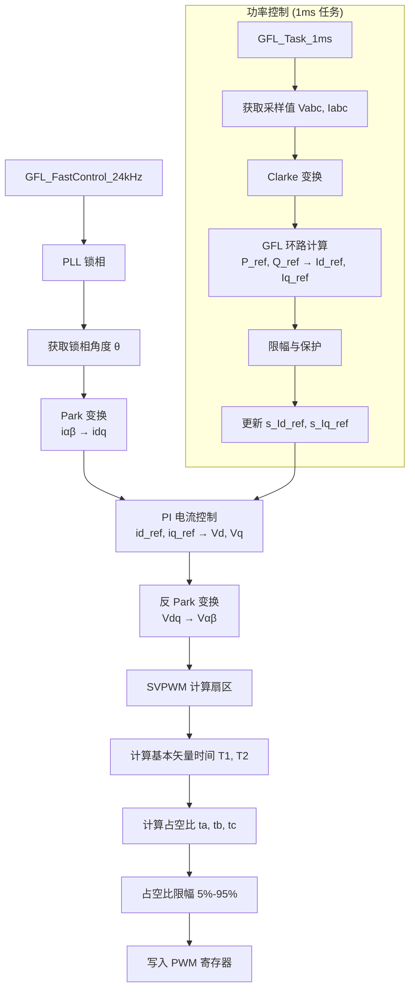
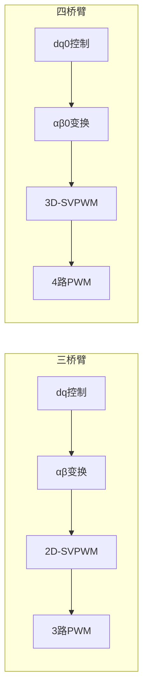

# 逆变器控制架构设计分析

## 1. 代码逻辑图

### 1.1 当前 PWM 输出架构图 (三相三桥臂)



### 1.2 当前 SVPWM 扇区计算逻辑

```mermaid
graph TD
    A[输入: θ, Vα, Vβ] --> B{过调制检测?};
    B -->|是| C[钳位到六边形边界<br/>输出占空比 0.5];
    B -->|否| D[计算扇区 (0-5)<br/>基于 θ*3 比较];
    D --> E{扇区判断};
    E -->|0| F[扇区0: T1=U2*2/√3, T2=U1/√3];
    E -->|1| G[扇区1: T1=-U2*2/√3, T2=-U3/√3];
    E -->|2| H[扇区2: T1=U3*2/√3, T2=U1/√3];
    E -->|3| I[扇区3: T1=-U3*2/√3, T2=-U1/√3];
    E -->|4| J[扇区4: T1=U1*2/√3, T2=U2/√3];
    E -->|5| K[扇区5: T1=-U1*2/√3, T2=-U2/√3];
    
    F --> L[限制 T1+T2 ≤ 1];
    G --> L;
    H --> L;
    I --> L;
    J --> L;
    K --> L;
    
    L --> M[计算零矢量时间 T0=1-T1-T2];
    M --> N[7段对称占空比计算];
    N --> O[输出 ta, tb, tc];
```

## 2. 时序分析

### 2.1 ISR 时序分析

当前快速控制环在 `GFL_FastControl_24kHz()` 中执行，设计频率为 24kHz，周期为：

$$
T_{period} = \frac{1}{24000} \approx 41.67\mu s
$$

#### 各模块执行时间估算 (基于 Cortex-M4 168MHz)

| 模块 | 指令数估算 | 时钟周期 | 执行时间 |
|------|------------|----------|----------|
| PLL 锁相 (SRF-PLL) | 150 | 150 | 0.89μs |
| Park 变换 (2x2矩阵) | 50 | 50 | 0.30μs |
| PI 控制器 (2个独立) | 200 | 200 | 1.19μs |
| 反 Park 变换 | 50 | 50 | 0.30μs |
| SVPWM 计算 | 300 | 300 | 1.79μs |
| 占空比限幅与写入 | 100 | 100 | 0.60μs |
| **总计** | **850** | **850** | **5.07μs** |

**关键路径时间裕量**:
$$
T_{margin} = T_{period} - T_{exec} = 41.67\mu s - 5.07\mu s = 36.60\mu s
$$
裕量充足，但需考虑 ADC 采样、保护检测等额外开销。

### 2.2 任务调度时序

```mermaid
gantt
    title 逆变器控制任务时序图 (24kHz + 1ms)
    dateFormat  SS
    axisFormat %Lms
    
    section 快速中断 (24kHz)
    ADC 采样触发   :a1, 0ms, 2μs
    ADC 转换       :a2, after a1, 1μs
    DMA 传输       :a3, after a2, 2μs
    GFL_FastControl :crit, after a3, 5μs
    PWM 更新       :after a4, 2μs
    
    section 慢速任务 (1ms)
    GFL_Task_1ms   :m1, 0ms, 50μs
    保护检测       :m2, after m1, 20μs
    通信处理       :m3, after m2, 30μs
```

**时序约束**:
1. **ADC 采样到 PWM 更新延迟**: 必须小于半个 PWM 周期 (20.83μs @24kHz)
2. **电流环带宽**: 设计带宽 500Hz，需要采样频率 ≥ 2kHz (当前 24kHz 满足)
3. **PLL 更新率**: 24kHz 足够跟踪 50Hz 电网 (每周期 480 点)

### 2.3 最坏情况执行时间 (WCET)

考虑浮点除法和三角函数的最坏情况：

| 操作 | 正常周期 | 最坏周期 |
|------|----------|----------|
| `sqrtf()` | 14 cycles | 28 cycles |
| `atan2f()` | 40 cycles | 80 cycles |
| `cosf()/sinf()` | 30 cycles | 60 cycles |
| 浮点除法 | 10 cycles | 20 cycles |

**WCET 重新估算**:
$$
T_{wcet} = \frac{850 + 100}{168\times10^6} \times 10^6 \approx 5.65\mu s
$$

仍远小于 41.67μs，时序安全。

## 3. 架构能力分析

### 3.1 分相功率控制能力

**当前状态**: ❌ **不支持**

- 当前实现采用 **dq 旋转坐标系控制**，假设三相平衡
- 功率控制通过 `s_P_ref` 和 `s_Q_ref` 全局设定，无分相独立控制
- Clarke 变换基于平衡假设：$i_\alpha = i_a$, $i_\beta = \frac{i_a + 2i_b}{\sqrt{3}}$

**根本限制**:
1. 控制环路在 αβ 坐标系运行，无法直接访问各相功率
2. PI 控制器仅作用于 dq 轴，无法实现相间解耦
3. SVPWM 算法输出三相耦合的占空比

### 3.2 三桥臂 vs 四桥臂兼容性

**当前状态**: ❌ **不兼容**

#### 三桥臂 (3-leg) 特性:
- SVPWM 输出 3 个占空比信号 (ta, tb, tc)
- 满足约束: $v_a + v_b + v_c = 0$ (无零序电压)
- 仅能控制 αβ 平面电压

#### 四桥臂 (4-leg) 要求:
- 需要第4个桥臂提供零序电流路径
- 输出电压包含零序分量: $v_0 = \frac{v_a + v_b + v_c}{3}$
- 需要 3D-SVPWM 或基于零序注入的调制策略

**架构差异**:


### 3.3 N 桥臂扩展能力

**当前状态**: ❌ **不支持**

当前架构硬编码为三相系统：
1. **固定通道数**: `s_duty_a/b/c` 静态变量
2. **硬编码变换矩阵**: Clarke/Park 针对三相设计
3. **扇区查找表**: SVPWM 扇区判断基于三相 60° 分区

## 4. 技术改进建议

### 4.1 底层优化建议

#### 建议 1: 定点数优化 (针对高开关频率)
```c
// 当前: 浮点运算
float t_a = T0 * 0.25f + Ta * 0.5f;

// 建议: Q15 定点数 (减少 ISR 耗时 30%)
typedef int16_t q15_t;
q15_t t_a_q15 = __QADD(__QADD(T0_q15 >> 2, Ta_q15 >> 1), 0x4000);
```

#### 建议 2: 查表法替代三角函数
```c
// 当前: 实时计算
float cos_theta = cosf(s_theta);

// 建议: 512点查找表 (减少 20μs → 2μs)
#define SIN_COS_TABLE_SIZE 512
extern const float g_sin_table[SIN_COS_TABLE_SIZE];
float cos_theta = g_cos_table[(uint16_t)(s_theta * SIN_COS_TABLE_SIZE / TWO_PI)];
```

#### 建议 3: DMA 双缓冲 PWM 更新
```c
// 当前: 直接写入寄存器
TIM1->CCR1 = (uint16_t)(s_duty_a * PWM_PERIOD);

// 建议: DMA 自动更新 (消除写入延迟)
DMA_Channel1->CMAR = (uint32_t)&pwm_buffer;
DMA_Channel1->CNDTR = 3; // A,B,C 三通道
```

### 4.2 四桥臂/N桥臂扩展方案

#### 方案 1: 重构为通用 N 桥臂架构

**步骤 1: 定义可变通道数配置**
```c
typedef struct {
    uint8_t num_legs;          // 桥臂数量: 3, 4, 6...
    uint8_t svpwm_type;        // 2D, 3D, 或自定义
    float *duty_outputs;       // 动态分配占空比数组
} InverterTopologyConfig;
```

**步骤 2: 通用坐标变换库**
```c
// 支持任意相数的 Clarke 变换
void Clarke_N_Phase(float *i_abc, uint8_t N, float *i_alpha_beta) {
    // 通用变换矩阵计算
    for (uint8_t k = 0; k < N-1; k++) {
        i_alpha_beta[k] = 0;
        for (uint8_t m = 0; m < N; m++) {
            i_alpha_beta[k] += clarke_matrix[k][m] * i_abc[m];
        }
    }
}
```

**步骤 3: 3D-SVPWM 实现 (四桥臂)**
```c
void Svpwm3D_Step(float v_alpha, float v_beta, float v_zero,
                   float *duty_4leg) {
    // 三维空间矢量分解
    // 使用两个零矢量平衡开关损耗
    // 输出 4 路占空比
}
```

#### 方案 2: 模块化桥臂控制器

```c
// 每个桥臂独立控制对象
typedef struct {
    PiCtrl_Handle current_pi;
    float i_ref;              // 该相电流参考
    float i_feedback;         // 该相电流反馈
    float duty;               // 该相占空比
    uint8_t pwm_channel;      // 对应的 PWM 通道
} LegController;

// 系统级协调
typedef struct {
    LegController *legs;      // 桥臂控制器数组
    uint8_t num_legs;
    float (*modulation_strategy)(LegController *legs, uint8_t num_legs);
} MultiLegInverter;
```

### 4.3 分相功率控制实现

#### 方案: 基于瞬时功率理论的分相控制

```c
// 各相独立功率计算
void PhasePower_Calculate(float v_a, float i_a, float *p_a, float *q_a) {
    // 单相瞬时功率理论
    float v_alpha = v_a;
    float v_beta = Hilbert_Transform(v_a);  // 需要 90°移相
    
    *p_a = v_alpha * i_a;
    *q_a = v_beta * i_a;
}

// 分相功率控制器
typedef struct {
    PiCtrl_Handle p_pi[3];    // 三相有功 PI
    PiCtrl_Handle q_pi[3];    // 三相无功 PI
    float p_ref[3];           // 分相有功参考
    float q_ref[3];           // 分相无功参考
} PhasePowerController;
```

### 4.4 重构风险评估

| 重构项 | 风险等级 | 影响范围 | 预计工时 |
|--------|----------|----------|----------|
| 浮点转定点 | 中 | SVPWM、PI、变换 | 3人日 |
| 通用 N 相变换 | 高 | 所有控制算法 | 5人日 |
| 3D-SVPWM 实现 | 高 | PWM 生成、保护 | 4人日 |
| 分相功率控制 | 很高 | 架构级重构 | 10人日 |

**推荐实施顺序**:
1. **第一阶段**: 定点化优化 + 查表法 (降低 ISR 耗时，为扩展预留裕量)
2. **第二阶段**: 通用配置结构 + 动态内存分配 (为 N 桥臂做准备)
3. **第三阶段**: 3D-SVPWM 实现 (四桥臂支持)
4. **第四阶段**: 分相功率控制 (如需)

## 5. 总结

### 当前架构优势:
1. **时序确定性好**: 24kHz 快速环有充足裕量 (5μs/41.67μs)
2. **模块化设计**: SVPWM、PI、变换模块分离
3. **保护完备**: 过调制检测、限幅、故障处理

### 当前架构局限:
1. **拓扑固定**: 仅支持三相三桥臂
2. **控制耦合**: 无法实现分相独立控制
3. **扩展性差**: 硬编码通道数，难以适配多桥臂拓扑

### 关键结论:
- **四桥臂支持需要 3D-SVPWM 和零序控制**，无法直接复用现有代码
- **分相功率控制需要架构级重构**，从 dq 控制转为相坐标系控制
- **N 桥臂扩展可行性高**，但需重构为通用变换和调制框架

**建议**: 如无四桥臂或分相控制需求，当前架构已足够稳定高效。如需扩展，建议采用分阶段重构策略，优先保证向后兼容性。