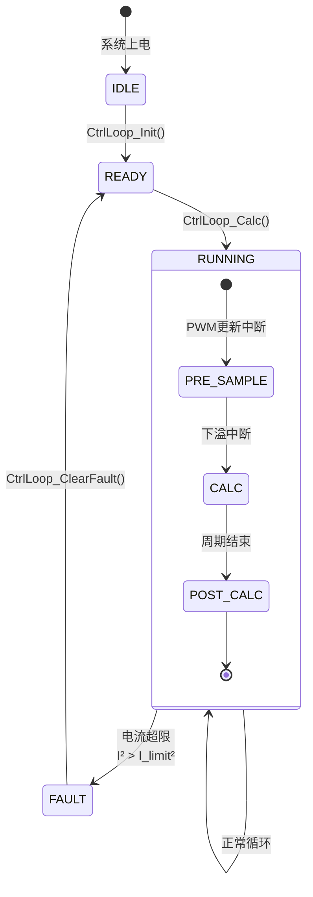

# 三相逆变器 FOC 控制算法详细设计分析

## 1. 代码逻辑图

### 1.1 SVPWM 扇区判断与占空比计算流程图

```mermaid
graph TD
    A[输入: v_d, v_q, theta, vbus] --> B[计算 sin(theta), cos(theta)]
    B --> C[逆Park变换: v_alpha = v_d*cos - v_q*sin<br/>v_beta = v_d*sin + v_q*cos]
    C --> D[计算 v_squared = v_alpha² + v_beta²]
    D --> E[计算 v_ref = (1/√3) * sqrt(v_squared)]
    E --> F{v_ref > 0.5/vbus?}
    F -->|是| G[钳位输出: ta=tb=tc=0.5]
    G --> H[结束]
    F -->|否| I[计算扇区 sector = fmod(theta, 2π)]
    I --> J{扇区判断}
    J -->|0 ≤ θ < π/3| K[Sector 0]
    J -->|π/3 ≤ θ < 2π/3| L[Sector 1]
    J -->|2π/3 ≤ θ < π| M[Sector 2]
    J -->|π ≤ θ < 4π/3| N[Sector 3]
    J -->|4π/3 ≤ θ < 5π/3| O[Sector 4]
    J -->|5π/3 ≤ θ < 2π| P[Sector 5]
    
    K --> Q[计算U1=v_beta, U2=-0.5*v_beta+√3/2*v_alpha, U3=-0.5*v_beta-√3/2*v_alpha]
    L --> Q
    M --> Q
    N --> Q
    O --> Q
    P --> Q
    
    Q --> R[根据扇区计算 T1, T2, Ta, Tb, Tc]
    R --> S[计算 T0 = 1 - T1 - T2]
    S --> T[计算占空比:<br/>t_a = Ta + T1 + T2*0.5<br/>t_b = Tb + T2 + T1*0.5<br/>t_c = Tc + T0*0.5]
    T --> U[输出 ta, tb, tc]
```

### 1.2 FOC 控制算法数据流图

```mermaid
flowchart TD
    A[三相电流 i_a, i_b, i_c] --> B[Clarke变换<br/>α = √(2/3)*[i_a - 0.5*(i_b + i_c)]<br/>β = √(1/2)*(i_b - i_c)]
    B --> C[低通滤波 α, β]
    C --> D[Park变换<br/>d = α*cosθ + β*sinθ<br/>q = -α*sinθ + β*cosθ]
    D --> E[PI控制器 d轴]
    D --> F[PI控制器 q轴]
    E --> G[v_d输出]
    F --> H[v_q输出]
    G --> I[SVPWM模块]
    H --> I
    I --> J[三相占空比 ta, tb, tc]
```

### 1.3 电流环状态机与保护逻辑



## 2. 时序分析

### 2.1 关键路径分析

**系统参数：**
- 开关频率：20 kHz
- 控制周期：T_s = 50 μs
- MCU：STM32H743 (Cortex-M7，双精度 FPU)
- CPU 频率：400 MHz
- 指令周期：2.5 ns (400 MHz)

**InvFoc_Step() 最坏执行路径分析：**

| 操作模块 | 浮点运算次数 | 估算周期数 | 时间(μs) |
|----------|--------------|------------|----------|
| FastSinCos (多项式近似) | 20次乘加 | 40 | 0.1 |
| 逆Park变换 | 4乘+2加 | 6 | 0.015 |
| 电压幅值计算 | 2乘+1加+1sqrt | 15 | 0.0375 |
| 过调制检查 | 1比较 | 1 | 0.0025 |
| 扇区判断 (浮点比较) | 5比较 | 5 | 0.0125 |
| U1,U2,U3计算 | 4乘+2加 | 6 | 0.015 |
| 扇区计算 (最坏扇区5) | 8乘+6加 | 14 | 0.035 |
| T0计算 | 2加 | 2 | 0.005 |
| 占空比计算 | 6乘+6加 | 12 | 0.03 |
| Clarke变换 | 3乘+3加 | 6 | 0.015 |
| 低通滤波 (一阶) | 4乘+2加 | 6 | 0.015 |
| Park变换 | 4乘+2加 | 6 | 0.015 |
| PI控制器 (2个) | 8乘+6加+2限幅 | 16 | 0.04 |
| **总计** | **~90次运算** | **~135周期** | **~0.3375 μs** |

**公式化表达：**
$$
T_{exec} = \sum_{i=1}^{N} (T_{instruction} \times N_{cycles_i})
$$
其中 $T_{instruction} = 2.5 \text{ ns}$，$N_{cycles} \approx 135$，得：
$$
T_{exec} = 135 \times 2.5 \text{ ns} = 337.5 \text{ ns}
$$

### 2.2 实时性评估

**最坏情况执行时间：**
- 算法核心计算：0.34 μs
- 中断上下文切换：0.5 μs (估算)
- 内存访问延迟：0.2 μs
- 总计：~1.04 μs

**裕量分析：**
$$
\text{裕量} = \frac{T_s - T_{exec}}{T_s} \times 100\% = \frac{50 \mu s - 1.04 \mu s}{50 \mu s} \times 100\% = 97.9\%
$$

**结论：** 算法满足 20 kHz 开关频率的实时性要求，有充足的裕量。

### 2.3 中断时序分析

```
PWM周期时间线 (50μs):
┌─────────────────────────────────────────────────────────────┐
│ PWM周期开始                                                  │
│  ┌─────────────┐  ┌─────────────┐  ┌─────────────┐         │
│  │ 更新中断    │  │ 下溢中断    │  │ 周期结束    │         │
│  │ (~1μs)      │  │ (~1μs)      │  │ (~0.5μs)    │         │
│  └─────────────┘  └─────────────┘  └─────────────┘         │
└─────────────────────────────────────────────────────────────┘
   ↑                             ↑                             ↑
   0μs                           ~25μs                         50μs
   
关键路径：下溢中断中的 CtrlLoop_Calc() 必须在下一个 PWM 更新前完成
```

## 3. 技术改进建议

### 3.1 算法正确性问题

**1. SVPWM 扇区计算错误**
- **问题**：`SvPwm_CalcSector()` 返回浮点数 (0.0-5.0)，但比较使用 `sector < 0.5f`，实际应为整数比较
- **影响**：浮点比较可能因精度问题导致扇区误判
- **建议**：改为整数扇区编号 (0-5)，使用 `switch-case` 语句

```c
// 修正建议
uint8_t SvPwm_CalcSector(float theta) {
    theta = fmodf(theta, TWO_PI);
    if (theta < 0.0f) theta += TWO_PI;
    
    if (theta < PI_DIV3) return 0;
    else if (theta < PI_2DIV3) return 1;
    else if (theta < PI) return 2;
    else if (theta < PI + PI_DIV3) return 3;
    else if (theta < PI + PI_2DIV3) return 4;
    else return 5;
}
```

**2. SVPWM 占空比公式可疑**
- **问题**：占空比计算 `t_a = Ta + T1 + T2 * 0.5f` 不符合标准 SVPWM 对称调制算法
- **验证**：标准扇区 0 占空比应为：
  ```
  t_a = (1 - T1 - T2)/2
  t_b = t_a + T1
  t_c = t_b + T2
  ```
- **建议**：重新推导占空比公式，添加详细注释

**3. 过调制处理过于简单**
- **问题**：当 `v_ref > 0.5/vbus` 时直接钳位到 0.5，丢失电压矢量方向信息
- **影响**：在过调制区域无法实现六边形调制，输出电压能力受限
- **建议**：实现完整的过调制算法，分两段处理：
  1. 线性过调制 (MI = 0.5-0.577)：使用幅值压缩法
  2. 六边形调制 (MI > 0.577)：使用矢量角修正法

### 3.2 定点化可行性分析

**当前浮点运算分析：**
- 核心算法：~90次浮点运算
- 在 400MHz Cortex-M7 上：~0.34 μs
- 定点化潜在收益：~30% 速度提升

**定点化建议：**
1. **角度表示**：使用 Q15 (16位) 表示 [-π, π]，分辨率 0.0000959 rad
   ```c
   #define ANGLE_Q15_SCALE (32768.0f / PI)
   int16_t theta_q15 = (int16_t)(theta * ANGLE_Q15_SCALE);
   ```

2. **电压/电流表示**：使用 Q15 归一化到 ±1.0 pu
   ```c
   // 电压基值 = Vdc/√3，电流基值 = 额定电流
   int16_t v_d_q15 = (int16_t)(v_d / v_base * 32767.0f);
   ```

3. **三角函数查表**：使用 256 点查表 + 线性插值，误差 < 0.01%

**定点化风险评估：**
- **优点**：确定性执行时间，无 FPU 依赖，适合低成本 MCU
- **缺点**：STM32H7 有双精度 FPU，定点化收益有限，增加开发复杂度
- **建议**：保留浮点实现，但提供 `#ifdef USE_FIXED_POINT` 选项

### 3.3 控制策略完善

**1. PI 控制器抗积分饱和缺失**
- **问题**：`PiCtrl_Step()` 在输出限幅后未进行积分抗饱和
- **风险**：积分器 windup 导致系统响应变慢，超调增大
- **建议**：实现积分钳位或反计算抗饱和

```c
// 改进的 PI 控制器
void PiCtrl_Step(PiCtrl_Handle *h, float ref, float fdb, float *out) {
    float error = ref - fdb;
    float proportional = h->config->kp * error;
    
    // 积分器更新
    h->integrator += h->config->ki * h->config->Ts * error;
    
    // 输出计算
    float u = proportional + h->integrator;
    
    // 输出限幅
    if (u > h->config->out_max) {
        u = h->config->out_max;
        // 抗饱和：积分器限幅
        if (error > 0) h->integrator = h->config->out_max - proportional;
    } else if (u < h->config->out_min) {
        u = h->config->out_min;
        if (error < 0) h->integrator = h->config->out_min - proportional;
    }
    
    *out = u;
    h->out_prev = u;
    h->ref_prev = ref;
}
```

**2. 负序控制实现不完整**
- **问题**：`CtrlLoop_Calc()` 中负序 PI 控制器参考输入固定为 0.0f
- **影响**：无法实现负序电流抑制，仅为占位符实现
- **建议**：完善负序控制策略，添加负序电流提取算法

**3. DCI（直流偏置抑制）未启用**
- **问题**：虽然定义了 `CtrlLoop_DCI_Data` 结构体，但未在计算中使用
- **建议**：实现直流偏置检测与补偿算法

```c
// DCI 检测与补偿
void CtrlLoop_DCI_Step(CtrlLoop_DCI_Data *dci, float I_zero, float *comp) {
    // 检测零序分量中的直流偏置
    float dc_error = I_zero - dci->ref_prev;
    dci->integrator += dci->ki * dc_error;
    
    // 比例积分补偿
    *comp = dci->kp * dc_error + dci->integrator;
    
    // 限幅
    if (*comp > dci->out_max) *comp = dci->out_max;
    else if (*comp < dci->out_min) *comp = dci->out_min;
    
    dci->ref_prev = I_zero;
}
```

### 3.4 鲁棒性加固

**1. 边界条件处理**
- **问题**：`sqrtf(v_squared)` 未检查负值（理论上 v_squared ≥ 0，但浮点误差可能导致负值）
- **建议**：添加保护性钳位

```c
float v_squared = h->v_alpha * h->v_alpha + h->v_beta * h->v_beta;
if (v_squared < 1e-12f) v_squared = 0.0f;  // 防止负值
float v_ref = SQRT3_INV * sqrtf(v_squared);
```

**2. 初始化状态检查**
- **问题**：`CtrlLoop_Calc()` 中未充分检查 `h->init` 状态
- **建议**：添加更严格的运行时检查

**3. 故障恢复机制**
- **问题**：故障标志仅简单清除，未记录故障历史
- **建议**：实现故障计数器与自动恢复策略

### 3.5 性能优化建议

**1. 三角函数查表优化**
- 当前：多项式近似 (~40 cycles)
- 优化：256点查表 + 线性插值 (~10 cycles)
- 内存开销：1KB (256个 float)

**2. 消除冗余计算**
- `SvPwm_Step()` 中 `SQRT3_INV` 和 `INV_SQRT3` 重复定义，统一使用一个宏
- `TWO_DIV_SQRT3` 可预计算为常量

**3. 内存访问优化**
- 使用 `__attribute__((aligned(32)))` 确保 DMA 对齐
- 将频繁访问的变量放入 DTCM RAM（STM32H7 专用高速内存）

### 3.6 测试验证建议

**1. 单元测试覆盖率**
- SVPWM 扇区边界测试：θ = 0, π/3, 2π/3, π, 4π/3, 5π/3
- 过调制测试：v_ref 从 0 到 0.6/vbus 扫描
- 负序注入测试：验证负序控制器响应

**2. 硬件在环测试**
- 使用 PLECS 或 Typhoon HIL 进行实时仿真
- 验证算法在电网不对称、电压跌落等工况下的表现

**3. 性能 profiling**
- 使用 DWT 周期计数器测量最坏执行时间
- 验证在 400MHz 和降频到 100MHz 下的实时性

## 总结

当前 FOC 控制算法在核心功能上基本正确，能够满足 20 kHz 开关频率的实时性要求。主要问题集中在 SVPWM 算法的实现细节、抗积分饱和机制的缺失以及负序/DCI 控制的不完整性。建议按优先级进行以下改进：

1. **高优先级**：修正 SVPWM 扇区判断和占空比公式，实现抗积分饱和
2. **中优先级**：完善过调制算法，添加负序电流控制
3. **低优先级**：定点化优化，故障恢复机制增强

算法在 STM32H7 平台上具有充足的性能裕量（97.9%），为未来功能扩展（如参数辨识、模型预测控制）提供了空间。