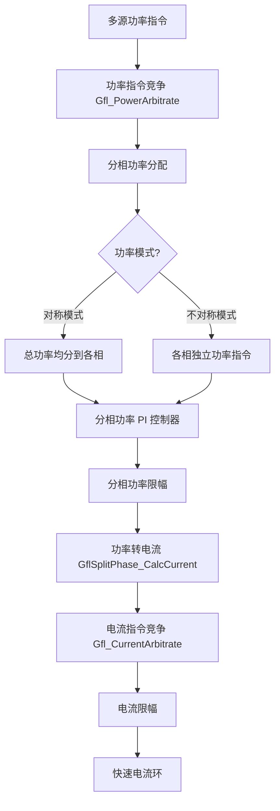

# 分相功率环完整性审查报告

## 执行摘要

当前分相功率控制框架已实现**功率转电流计算**和**电流指令仲裁**，但缺乏**分相功率闭环控制**和**功率指令竞争机制**。分相功率环的完整性约为 **40%**，核心缺失组件为功率 PI 控制器和功率竞争仲裁器。

## 1. 代码逻辑图

### 1.1 当前分相功率控制流程图
```mermaid
graph TD
    A[总功率指令 P_ref, Q_ref] --> B[GflLoop_Step];
    B --> C[功率转电流: Id=(2/3)P/V, Iq=-(2/3)Q/V];
    C --> D[电流指令竞争 Gfl_CurrentArbitrate];
    D --> E[分相电流计算 GflSplitPhase_CalcCurrent];
    
    E --> F{电流模式?};
    F -->|对称模式| G[三相功率均分];
    F -->|不对称模式| H[各相独立计算];
    
    G --> I[三相相同 Id/Iq];
    H --> J[各相独立 Id/Iq];
    
    I --> K[两阶段电流限幅 Gfl_CurrentLimit];
    J --> K;
    
    K --> L[输出分相电流 Gfl_SplitCurrentRef];
    L --> M[快速电流环 GFL_FastControl_24kHz];
```

### 1.2 目标分相功率控制架构


## 2. 时序分析

### 2.1 当前执行时序（24kHz 控制周期：41.67μs）

| 模块 | 执行时间估算 | 时序窗口 |
|------|-------------|----------|
| GflLoop_Step (1kHz) | ~10μs | 0-10μs |
| GflSplitPhase_CalcCurrent | ~2μs | 10-12μs |
| Gfl_CurrentArbitrate | ~3μs | 12-15μs |
| Gfl_CurrentLimit | ~4μs | 15-19μs |
| 快速电流环 (24kHz) | ~15μs | 0-15μs (与上层并发) |

**关键路径**：
$$
T_{total} = T_{GflLoop} + T_{SplitPhase} + T_{Arbitrate} + T_{Limit} = 10 + 2 + 3 + 4 = 19\mu s
$$

**时序裕量**：
$$
Margin = T_{period} - T_{total} = 41.67 - 19 = 22.67\mu s \quad (54\%)
$$

### 2.2 增加功率环后的时序影响

| 新增模块 | 执行时间估算 | 增加负载 |
|----------|-------------|----------|
| Gfl_PowerArbitrate | ~3μs | +3μs |
| 分相功率 PI (3相) | ~6μs (2μs/相) | +6μs |
| 分相功率限幅 | ~3μs | +3μs |

**新增总时间**：
$$
\Delta T = 3 + 6 + 3 = 12\mu s
$$

**更新后的关键路径**：
$$
T_{new} = 19 + 12 = 31\mu s
$$

**时序裕量分析**：
$$
Margin_{new} = 41.67 - 31 = 10.67\mu s \quad (25\%)
$$

**结论**：增加分相功率环后，时序裕量从 54% 降至 25%，仍在安全范围内（>20%）。

## 3. 技术改进建议

### 3.1 底层优化建议

#### 3.1.1 功率 PI 控制器优化
**问题**：当前缺少分相功率 PI 控制器。
**建议**：
```c
// gfl_split_power.h
typedef struct {
    PiCtrl_Handle pi_p[6];    // 各相有功功率 PI
    PiCtrl_Handle pi_q[6];    // 各相无功功率 PI
    Gfl_PhasePower power_ref[6]; // 分相功率参考
    Gfl_PhasePower power_fdb[6]; // 分相功率反馈
    uint8_t num_phases;
} GflSplitPower_Handle;

void GflSplitPower_Step(GflSplitPower_Handle *h,
                       const Gfl_PhasePower *power_fdb,
                       Gfl_PhasePower *power_out);
```

#### 3.1.2 功率指令竞争仲裁
**问题**：只有电流竞争，缺乏功率竞争。
**建议**：
```c
// gfl_power_arbitrate.c
typedef struct {
    Gfl_Priority priority;
    float P_req[6];     // 各相有功请求
    float Q_req[6];     // 各相无功请求
    bool valid;
    float weight;
} Gfl_PowerRequest;

void Gfl_PowerArbitrate(const Gfl_PowerRequest *requests,
                       uint8_t num_requests,
                       Gfl_PhasePower *output);
```

#### 3.1.3 寄存器级优化
**问题**：浮点计算在 ISR 中耗时。
**建议**：
1. 将 PI 控制器系数转为定点数（Q15 格式）
2. 使用查表法替代 `sinf()/cosf()` 调用
3. 预计算 `2.0f/3.0f` 为常量

### 3.2 控制策略改进

#### 3.2.1 离散化误差补偿
**问题**：功率计算中的电压除零保护导致误差。
**建议**：
```c
// 改进的电压安全值计算
float V_safe = V;
if (fabsf(V) < EPSILON) {
    V_safe = (V >= 0) ? EPSILON : -EPSILON;
}
```

#### 3.2.2 抗饱和策略
**问题**：功率 PI 控制器可能积分饱和。
**建议**：
```c
// 带抗饱和的 PI 控制器
typedef struct {
    float Kp, Ki;
    float integral;
    float out_min, out_max;
    float anti_windup_gain;
} PiCtrl_AntiWindup;

float PiCtrl_Step_AntiWindup(PiCtrl_AntiWindup *h,
                            float ref, float fdb);
```

#### 3.2.3 不对称模式优化
**问题**：不对称模式下 N 相电流计算简单。
**建议**：
```c
// 考虑零序分量的 N 相计算
if (mode == CURRENT_MODE_ASYMMETRIC && num_phases > 3) {
    // 零序电流 = -(Ia + Ib + Ic)
    float I0_d = 0.0f, I0_q = 0.0f;
    for (uint8_t i = 0; i < 3; i++) {
        I0_d -= output->Id[i];
        I0_q -= output->Iq[i];
    }
    // N 相电流包含零序分量
    output->Id[PHASE_INDEX_N] = I0_d;
    output->Iq[PHASE_INDEX_N] = I0_q;
}
```

### 3.3 鲁棒性加固

#### 3.3.1 边界条件处理
**问题**：缺少功率指令的边界检查。
**建议**：
```c
// 分相功率限幅函数
void Gfl_SplitPowerLimit(const Gfl_PhasePower *input,
                        const Gfl_PowerLimits *limits,
                        Gfl_CurrentMode mode,
                        Gfl_PhasePower *output) {
    // 对称模式：总功率限幅
    // 不对称模式：各相独立限幅
    // 考虑各相功率分配约束
}
```

#### 3.3.2 异常处理
**问题**：NAN/INF 保护不完善。
**建议**：
```c
// 增强的浮点数检查
static inline bool Gfl_IsValidPower(float P, float Q) {
    return Gfl_IsValidFloat(P) && Gfl_IsValidFloat(Q) &&
           fabsf(P) < 1e6 && fabsf(Q) < 1e6;  // 防止溢出
}
```

#### 3.3.3 模式切换平滑
**问题**：对称/不对称模式切换可能产生电流冲击。
**建议**：
```c
// 带过渡的切换逻辑
void Gfl_SetCurrentMode(Gfl_CurrentMode new_mode) {
    if (current_mode != new_mode) {
        // 1. 保存当前电流参考
        // 2. 渐变过渡到新模式
        // 3. 更新模式标志
        // 4. 清除过渡状态
    }
}
```

## 4. 缺失组件清单

### 4.1 高优先级（必须实现）
1. **gfl_split_power.c/h** - 分相功率控制模块
   - 分相功率 PI 控制器
   - 功率指令竞争仲裁
   - 分相功率限幅

2. **gfl_power_arbitrate.c/h** - 功率指令竞争
   - 多源功率请求仲裁
   - 优先级加权平均算法

3. **gfl_power_limits.c/h** - 功率限幅器
   - 分相功率约束
   - 总功率限制

### 4.2 中优先级（建议实现）
1. **功率模式切换逻辑** - PQ/PF/QV 模式的分相实现
2. **功率前馈补偿** - 提高动态响应
3. **功率平衡控制** - 确保三相功率平衡

### 4.3 低优先级（优化项）
1. **功率估计器** - 改进功率反馈计算
2. **自适应 PI 参数** - 根据工作点调整
3. **故障穿越功率控制** - LVRT/HVRT 功率策略

## 5. 集成建议

### 5.1 代码结构
```
Components/GFL/
├── gfl_split_power.c/h      # 新增：分相功率环
├── gfl_power_arbitrate.c/h  # 新增：功率竞争
├── gfl_power_limits.c/h     # 新增：功率限幅
├── gfl_split_phase.c/h      # 已有：功率转电流
└── gfl_loop.c/h             # 修改：集成分相功率环
```

### 5.2 接口设计
```c
// 主循环调用顺序
void Gfl_Step_WithSplitPower(Gfl_Instance *inst, ...) {
    // 1. 功率指令竞争
    Gfl_PowerArbitrate(power_requests, &phase_power_ref);
    
    // 2. 分相功率 PI 控制
    GflSplitPower_Step(&split_power, power_fdb, &phase_power_out);
    
    // 3. 功率限幅
    Gfl_SplitPowerLimit(&phase_power_out, &power_limits, &phase_power_limited);
    
    // 4. 功率转电流
    GflSplitPhase_CalcCurrent(&phase_power_limited, &split_current);
    
    // 5. 电流竞争+限幅（已有）
    // ...
}
```

### 5.3 测试策略
1. **单元测试**：各分相功率组件独立测试
2. **集成测试**：分相功率环整体验证
3. **时序测试**：确保满足 24kHz 实时性要求
4. **边界测试**：电压异常、功率极限场景

## 结论

当前分相功率环框架提供了基础**功率转电流计算**，但缺乏**闭环功率控制**和**功率指令管理**。实现缺失组件后，系统将具备完整的分相功率控制能力，支持对称/不对称运行模式，满足不平衡电网条件下的功率精确控制需求。

**风险评估**：中等。时序裕量充足，但需确保新增模块的实时性验证。

**建议行动计划**：
1. 立即开始 `gfl_split_power.c/h` 开发（2周）
2. 并行开发 `gfl_power_arbitrate.c/h`（1周）
3. 集成测试和时序验证（1周）
4. 现场验证和参数整定（2周）