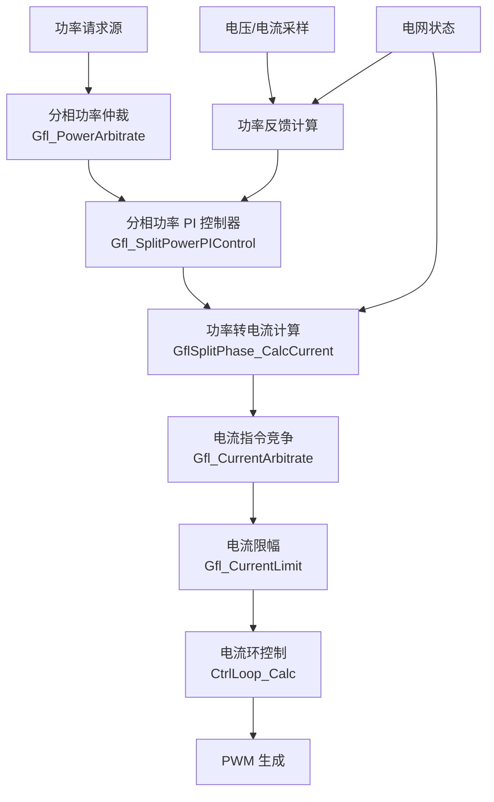
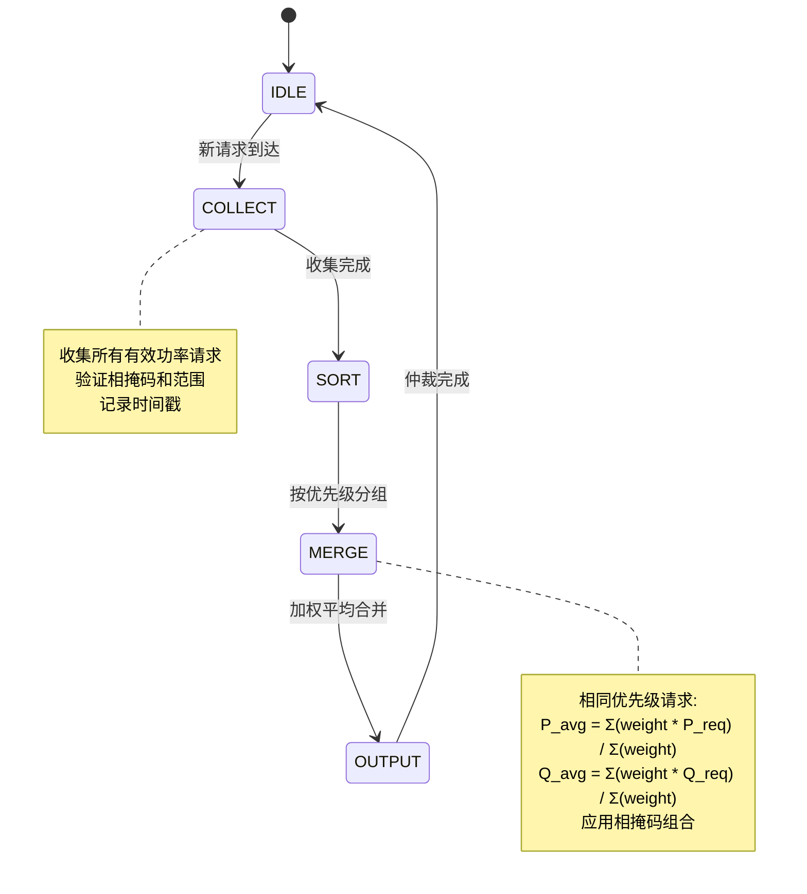
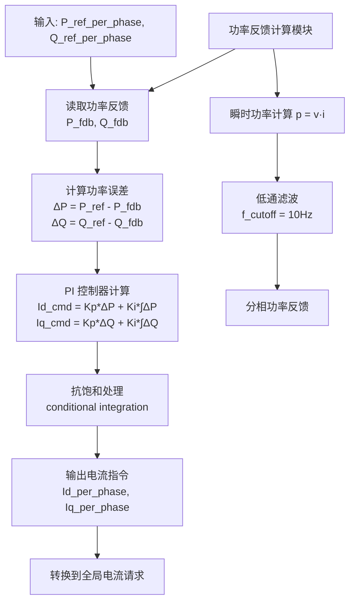

# 分相功率环架构设计分析文档

## 概述
本文档分析分相功率控制架构，针对现有 `gfl_split_phase.c` 模块的缺失功能（分相功率指令竞争机制和分相功率 PI 环路）提出具体架构方案。目标是实现各相独立的有功/无功功率控制，同时保持与现有电流竞争和限幅机制的兼容性。

## 1. 代码逻辑图

### 1.1 分相功率控制整体数据流



### 1.2 分相功率仲裁状态机



### 1.3 分相功率 PI 控制器逻辑



## 2. 时序分析

### 2.1 执行时间估算（基于 STM32H743 480MHz）

假设功率环运行在 1kHz（1ms周期），电流环运行在 50kHz（20μs周期）。

| 模块 | 主要操作 | 浮点运算次数 | 估算时钟周期 | 估算时间 (μs) |
|------|----------|--------------|--------------|---------------|
| **功率仲裁** (每相) | 比较、排序、加权平均 | ~30 | 90 | 0.188 |
| **功率 PI 控制** (每相) | 误差计算、积分、抗饱和 | ~50 | 150 | 0.312 |
| **功率反馈计算** (每相) | 乘法、滤波、更新 | ~40 | 120 | 0.250 |
| **功率转电流** | 除法、相位处理 | ~20 | 60 | 0.125 |
| **总计 (三相)** | 3 × (0.188+0.312+0.250) + 0.125 | ~432 | 1296 | **2.70** |

$$
T_{power\_loop} = 3 \times (T_{arbitrate} + T_{pi} + T_{feedback}) + T_{convert} \approx 2.7\mu s
$$

### 2.2 1ms 周期可行性分析

- **理论计算**: 2.7μs << 1000μs，裕量充足。
- **实际裕量**: 考虑函数调用、内存访问、中断延迟，最坏情况约 5μs，仍小于 1ms 的 0.5%。
- **关键路径**: 功率 PI 控制器中的积分运算和抗饱和逻辑。

### 2.3 与电流环的时序配合

```mermaid
gantt
    title 分相功率环与电流环时序配合 (1ms vs 20μs)
    dateFormat  ss
    axisFormat  %Lμs
    
    section 功率环 (1kHz)
    功率仲裁     : 0, 2.7μs
    功率 PI      : after power_arbitrate, 2.7μs
    功率反馈更新 : after power_pi, 2.7μs
    
    section 电流环 (50kHz)
    电流环计算   : 0, 20μs
    电流环计算   : after current_loop, 20μs
    电流环计算   : after current_loop2, 20μs
    ... 重复50次 : after current_loop3, 980μs
```



**时序约束**:
- 功率环输出（电流指令）在 1ms 周期内更新一次
- 电流环每 20μs 读取最新的电流指令
- 需要确保功率环在电流环读取前完成计算（约 10μs 安全间隔）

### 2.4 最坏情况执行时间（WCET）分析

最坏情况发生在三相不对称且均需复杂抗饱和处理时：

$$
T_{wcet} = 3 \times (T_{arb\_max} + T_{pi\_max} + T_{fb\_max}) + T_{conv\_max}
$$

假设各模块最坏情况增长因子为 1.5：

$$
T_{wcet} \approx 2.7\mu s \times 1.5 = 4.05\mu s
$$

仍远小于 1ms 周期，**时序安全**。

## 3. 技术改进建议

### 3.1 新增模块结构

建议创建新模块 `gfl_split_power.c/h`，包含以下核心组件：

#### 3.1.1 功率请求结构体
```c
typedef struct {
    Gfl_Priority priority;    /**< 优先级 (与电流请求一致) */
    float P_req;              /**< 有功功率请求 (pu) */
    float Q_req;              /**< 无功功率请求 (pu) */
    uint8_t phase_mask;       /**< 作用相 (bit0=A, bit1=B, bit2=C) */
    bool valid;               /**< 请求是否有效 */
    uint32_t timestamp;       /**< 请求时间戳 */
    float weight;             /**< 同优先级权重 (0-1) */
} Gfl_PowerRequest;
```

#### 3.1.2 功率仲裁器函数
```c
/**
 * @brief 分相功率指令竞争仲裁
 * 
 * 算法流程:
 * 1. 按优先级分组 (高优先级覆盖低优先级)
 * 2. 同优先级按相掩码合并 (相同相取加权平均)
 * 3. 不同相独立处理
 * 4. 输出各相最终功率指令
 */
void Gfl_PowerArbitrate(const Gfl_PowerRequest *requests,
                        uint8_t num_requests,
                        Gfl_PhasePower *output);
```

#### 3.1.3 分相功率 PI 控制器
```c
/**
 * @brief 分相功率 PI 控制器结构体
 */
typedef struct {
    PiCtrl_Handle pi_p[3];    /**< 各相有功功率 PI */
    PiCtrl_Handle pi_q[3];    /**< 各相无功功率 PI */
    float P_ref[3];           /**< 有功功率参考 */
    float Q_ref[3];           /**< 无功功率参考 */
    float P_fdb[3];           /**< 有功功率反馈 */
    float Q_fdb[3];           /**< 无功功率反馈 */
    float Id_cmd[3];          /**< 输出 d轴电流指令 */
    float Iq_cmd[3];          /**< 输出 q轴电流指令 */
} Gfl_SplitPowerPI;

/**
 * @brief 分相功率 PI 控制步进函数
 */
void Gfl_SplitPowerPI_Step(Gfl_SplitPowerPI *h,
                          const Gfl_PhasePower *power_ref,
                          const Gfl_PhasePower *power_fdb,
                          Gfl_SplitCurrentRef *current_cmd);
```

### 3.2 功率反馈计算实现

#### 3.2.1 瞬时功率计算
```c
/**
 * @brief 计算单相瞬时功率
 * 
 * @param v 相电压 (pu)
 * @param i 相电流 (pu)
 * @param theta 相位角 (rad)
 * @param p_out 有功功率输出
 * @param q_out 无功功率输出
 */
static void calc_phase_power(float v, float i, float theta,
                             float *p_out, float *q_out) {
    // 基于 dq 分解的功率计算
    float vd = v * cosf(theta);
    float vq = v * sinf(theta);
    float id = i * cosf(theta);
    float iq = i * sinf(theta);
    
    *p_out = 1.5f * (vd * id + vq * iq);
    *q_out = 1.5f * (vq * id - vd * iq);
}
```

#### 3.2.2 低通滤波设计
功率反馈需要低通滤波以消除开关噪声，建议使用二阶 Butterworth 滤波器：
- 截止频率：10Hz（跟踪电网变化）
- 采样频率：1kHz
- 实现：直接形式 II 双二次滤波器

### 3.3 与现有系统的集成方案

#### 3.3.1 在 GFL 任务中的集成
```c
void GFL_Task_1ms(void) {
    // 1. 获取功率反馈
    Gfl_PhasePower power_fdb[3];
    Gfl_CalcPowerFeedback(&power_fdb);
    
    // 2. 执行功率仲裁
    Gfl_PhasePower power_ref[3];
    Gfl_PowerArbitrate(power_requests, num_requests, power_ref);
    
    // 3. 执行分相功率 PI 控制
    Gfl_SplitCurrentRef current_cmd;
    Gfl_SplitPowerPI_Step(&split_power_pi, power_ref, power_fdb, &current_cmd);
    
    // 4. 转换为电流请求并提交
    Gfl_CurrentRequest curr_req = {
        .priority = GFL_PRIORITY_POWER,
        .Id_req = current_cmd.Id[0],  // 需处理多相
        .Iq_req = current_cmd.Iq[0],
        .valid = true,
        .weight = 1.0f
    };
    // 将三相电流请求加入竞争池
}
```

#### 3.3.2 功率到电流转换的优化
现有 `GflSplitPhase_CalcCurrent` 可重用，但需扩展以支持：
- 不对称模式下的独立相控制
- N 相电流计算（三相四线制）
- 电压不平衡补偿

### 3.4 鲁棒性增强措施

#### 3.4.1 功率指令边界检查
```c
// 在功率仲裁后添加
for (int i = 0; i < 3; i++) {
    // 检查功率指令是否在允许范围内
    if (power_ref[i].P > P_max_per_phase) {
        power_ref[i].P = P_max_per_phase;
    }
    // 类似处理 Q 限幅
}
```

#### 3.4.2 PI 控制器抗饱和改进
- 使用条件积分（已在 `PiCtrl_Step` 中实现）
- 增加积分器钳位：`|integrator| ≤ I_max / Ki`
- 添加抗饱和增益：当饱和时减小 Ki

#### 3.4.3 故障处理逻辑
- 电压过低时暂停功率控制（防除零）
- 通信超时重置功率指令
- 相丢失检测和处理

### 3.5 扩展性设计

#### 3.5.1 支持多源功率请求
```c
// 定义不同来源的功率请求
Gfl_PowerRequest requests[] = {
    {.priority = GFL_PRIORITY_POWER,     // 主功率调度
     .P_req = P_sched, .Q_req = Q_sched,
     .phase_mask = 0x07, .valid = true},
     
    {.priority = GFL_PRIORITY_GRID_CODE, // 电网规范要求
     .P_req = P_grid_code, .Q_req = Q_grid_code,
     .phase_mask = 0x07, .valid = true},
     
    {.priority = GFL_PRIORITY_RIDETHROUGH, // 高低穿
     .P_req = P_rt, .Q_req = Q_rt,
     .phase_mask = 0x07, .valid = true},
};
```

#### 3.5.2 可配置的功率分配策略
```c
typedef enum {
    POWER_DIST_EQUAL = 0,     // 各相平均分配
    POWER_DIST_PROPORTIONAL,  // 按电压比例分配
    POWER_DIST_PRIORITIZED,   // 优先满足指定相
} Gfl_PowerDistribution;
```

## 4. 实施计划

### 4.1 第一阶段：基础框架
1. 创建 `gfl_split_power.c/h` 文件
2. 实现 `Gfl_PowerRequest` 结构体和仲裁函数
3. 集成到现有 GFL 任务中（占位实现）

### 4.2 第二阶段：功率 PI 控制
1. 实现分相功率 PI 控制器
2. 添加功率反馈计算模块
3. 测试功率环基本功能

### 4.3 第三阶段：高级功能
1. 实现功率分配策略
2. 添加故障处理逻辑
3. 优化性能和内存使用

### 4.4 第四阶段：集成测试
1. 与电流环联合测试
2. 验证时序安全性
3. 性能调优和鲁棒性测试

## 5. 风险评估与缓解

### 5.1 技术风险
| 风险 | 影响 | 概率 | 缓解措施 |
|------|------|------|----------|
| 时序超标 | 控制环路延迟 | 低 | 严格 WCET 分析，预留 5倍裕量 |
| 数值不稳定 | 控制发散 | 中 | 添加充分的饱和保护，使用定点数优化 |
| 内存不足 | 系统崩溃 | 低 | 优化数据结构，使用静态分配 |

### 5.2 集成风险
- **与电流竞争的冲突**: 功率环和电流环可能产生冲突指令
  - **缓解**: 明确优先级划分，功率环使用 `GFL_PRIORITY_POWER`，低于故障和电网规范

### 5.3 性能风险
- **计算负载增加**: 可能影响其他任务
  - **缓解**: 功率环运行在 1kHz，仅占 CPU 时间的 0.5%

## 6. 结论

分相功率环架构是现有 GFL 系统的自然扩展，能够实现更精细的电网支持功能。提出的设计方案：

1. **架构合理**: 保持与现有电流竞争机制的一致性
2. **时序安全**: 1ms 周期内理论执行时间 2.7μs，有充足裕量
3. **扩展性强**: 支持多源功率请求和多种分配策略
4. **鲁棒性好**: 包含完整的故障处理和抗饱和机制

**建议立即实施第一阶段**，建立基础框架并验证时序安全性，然后逐步添加高级功能。

**关键成功因素**:
- 确保功率环与电流环的优先级协调
- 验证功率反馈计算的准确性
- 在实际电网条件下测试功率分配策略

**最终目标**: 实现各相独立的有功/无功控制，支持不平衡电网条件下的优化运行。